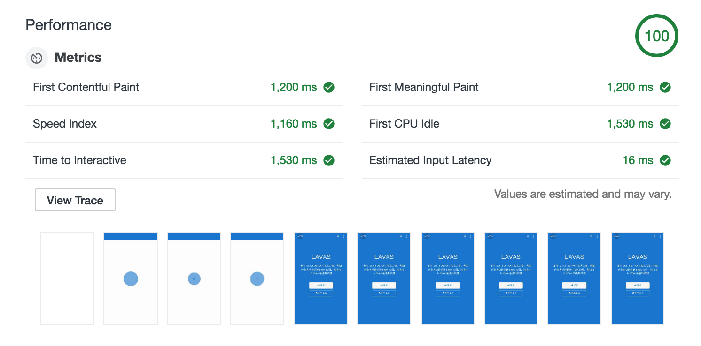
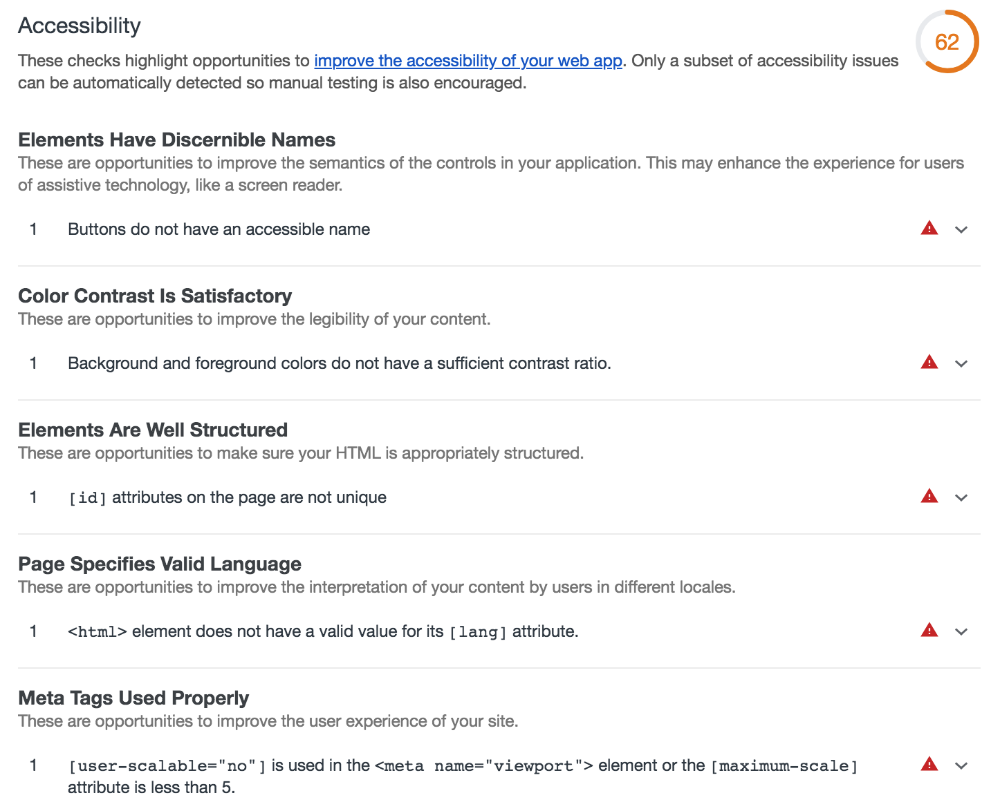

## Lighthouse 使用案例

前面两节我们对 Lighthouse 的使用方法和性能评分计算的原理有了一定的了解，下面我们使用 Lighthouse 对一个实际站点 [https://lavas.baidu.com/](https://lavas.baidu.com/) 进行测试，看看 Lighthouse 能对站点提供哪些方面的改进指导。

### 对站点进行测试

为了更直观地展示测试结果，我们使用 Chrome Devtools 中集成的 Lighthouse 工具进行测试。

1. 在 Chrome 中打开 https://lavas.baidu.com/
2. 打开 Chrome Devtools，并选择 `Audits` 面板
3. Lighthouse 提供了不同的模拟网络环境选项，我们可以根据需求进行选择，点击 `Run Audits` 开始测试。

### 测试结果

稍等片刻，Chrome 会新建一个新的会话窗口，将包含各项评分指标的 Lighthouse 测试报告展示出来，我们可以依次来看：

#### 总体评分

报告的最上方是总体评分，如下图，可以看到站点在性能、PWA、最佳实践及 SEO 方面的表现还是不错的，在无障碍访问指标项上，评分稍低，需要重点进行改进。

具体到每一个方面，都能查看指标项的细节：

#### Performance 性能评分

在选择网络环境为 `No throttling` 的条件下，FCP，FMP，首次交互时间等指标都能得到详细的统计，`View Trace` 还能看到页面每一帧的渲染过程。

Metrics 部分的指标与性能评分关联紧密，可以看到各个指标项都显示绿色，意味着它们都得到了 90-100 的分值。Opportunities 和 Diagnostics 部分的指标项虽然不纳入评分的计算，但也给我们改进提供了参考。可以看到站点存在字体文件加载优化、静态资源缓存等问题。

#### PWA 评分

在基准指标检查中，有一项未通过：Lighthouse 建议站点需要对 JavaScript 脚本不能正确加载的情况作降级处理。我们需要改进的是，页面的核心渲染脚本加载失败时，仍能够展示基本的静态内容，而不是空白页面，这一点在客户端渲染的 SPA 应用中尤其需要引起重视。除此之外，我们可以看到站点的其他 PWA 自动检查项都已经通过，然后手动检查一下跨浏览器兼容性、页面切换流畅度、页面 URL 等检查项即可。

#### 无障碍访问评分

此项评分偏低，仅得到62分，说明站点在这部分存在的问题较多。展开可以看到问题的详情，如 DOM 元素使用不规范、结构不合理，页面颜色对比度不够，Meta 信息使用不正确等等，如果需要提高站点的无障碍可访问性，我们可以从这些方面对症下药进行完善。

#### Best Practices 最佳实践评分

站点在这部分的表现中规中矩，通过了15个检查项中的12个，暴露了3个问题，资源推荐使用 http2，跨域的跳转链接需要使用 rel 标识，不能使用废弃的 API。不通过检查测试，开发中我们很难注意到这些细节问题。

#### SEO 搜索引擎优化评分

结果显示站点的 robots.txt 文件缺失，需要改进。

### 小结

通过上述简单演示，我们对站点的各项指标就能有较为直观的了解，评分高的指标项值得积累开发经验，评分低的指标，对照着测试报告给出的建议，我们可以逐一完善。

Lighthouse 是一个开源的项目，主要由 Google Chrome 团队开发维护，它包含了强大的功能和较为繁荣的周边生态，本章只是就其使用方式、打分机制、测评指标等作了简要的介绍，在实际的 PWA 工程中，我们可能会运用到更详细的配置选项和测试参数，或者需要深入了解其运行原理，这些都可以通过 Github 上的项目文档进一步学习和实践。工欲善其事，必先利其器，有了 Lighthouse 这把利器的帮助，我们打造体验更好的 PWA 站点将不再是难事！

