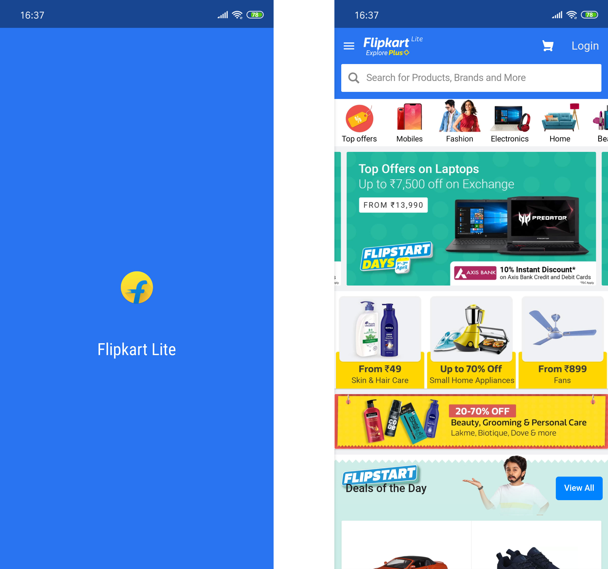
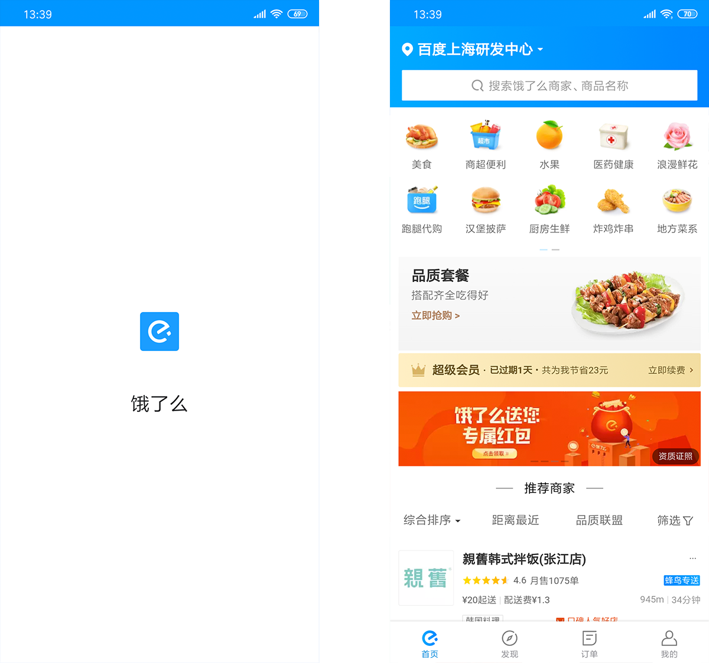

# PWA 的发展

从 PWA 被提出到现在，已经过去了 4 年，PWA 取得的成绩有目共睹，特别是在国外，在网络速度不够快或者相对贫困的地区，PWA 非常受欢迎，因为它不需要很高的硬件配置，也很省流量，比如在印度，就有一个很成功的案例，Flipkart。

## Flipkart

[Flipkart](https://www.flipkart.com) 是印度最大的电商公司，在 2015 年的时候，他们关停了 Web App，尝试将用户导流到 Native App，后来发现在产品快速迭代和好的用户体验之间很难做到两者兼得，因此他们决定将 Web App 和 Native App 整合为 PWA，通过 Service Worker，Web App Manifest 等技术的使用，PWA 不仅在体验上达到了他们的标准，同时还具有了 Web App 的产品迭代速度。

采用 PWA 后，取得的成绩斐然，关键收益如下：

* 用户时长增加了 3 倍，传统 Web 是 70 秒，而 PWA 达到了 3.5 分钟。
* 用户回流率提升了 40%。
* 添加到主屏的用户转化率提高了 70%。
* 用户数据流量的消耗降低了 3 倍。

### 阿里速卖通(AliExpress)

[阿里速卖通](https://m.aliexpress.com)是阿里巴巴旗下的一款产品，对外销售来自中国的各种产品。AliExpress 的困境在于，用户不愿意下载安装他们的 Native App，即使在 Web App 中对 Native App 有足够的引流，导致获客成本很高。

最后，AliExpress 选择了 PWA，他们的出发点在于提升 Web App 的体验和用户黏性。带来的收益也非常的明显，如下：

* 在 PWA 中，新用户的转化率提升了 104%。
* 在一次会话中，用户访问的页面数量增加了 2 倍。
* 用户时长增加了 74%。

### 饿了么

不仅在国外，国内同样也有 PWA 的案例，[饿了么](https://ele.me)，作为国内最早一批尝试 PWA 的站点，同样也取得了不小的收益。

饿了么做 PWA 站点的出发点和 Flipkart、AliExpress 不完全一样，它几乎纯粹是从性能优化的角度接入的 PWA，当时国内的浏览器市场比较混乱，对 PWA 支持的不是很完善。饿了么 PWA 采取的是多页应用（Multi-Page Application），和 PWA 推荐的 SPA（Single Page Application）不一样，主要是考虑到多个团队合作共同开发同一个站点，不过在体验上并没有打折扣，现在是 Google 对外展示的一个成功案例。

看一下饿了么 PWA 的收益：

* 预缓存的页面加载时间缩短了 11.6%。
* 所有页面平均加载时间缩短了 6.35%。
* 在 3G 网络下，第一次加载首次可交互时间缩短了 4.93 秒。

## 标准的支持

PWA 采用的最新技术，当前浏览器还没有达到完全支持的程度，很多技术在 W3C 还没有定稿，不过这也意味着这些技术的还有很大的想象空间。

根据 [Can I Use](https://caniuse.com) 的统计（包括 PC 和移动端，截至 2019 年 4 月 2 日），PWA 的关键技术在浏览器中的支持度如下：

* Web App Manifest 的支持度达到 80.63%。
* Service Worker 的支持度达到 89.84%。
* Notifications API 的支持度达到 75.17%。
* Push API 的支持度达到 78.06%。

随着标准的进一步完善，国内外各大浏览器都会逐步支持，拥抱标准。Chrome 自不必说，Apple 从 iOS 11.3 版本开始在 Safari 上支持 Service Worker，iOS 12.2 版本修复了 PWA 很多致命的体验问题，支持了 Web Share API 等。可见大家都在拥抱标准，拥抱开放。

Can I Use 的统计由于一些原因在国内不是很适用，为此百度 Web 生态团队维护了一份列表，开发者可以在上面查看国内各主流浏览器对 PWA 主要技术的支持程度，[https://lavas.baidu.com/ready](https://lavas.baidu.com/ready)。
