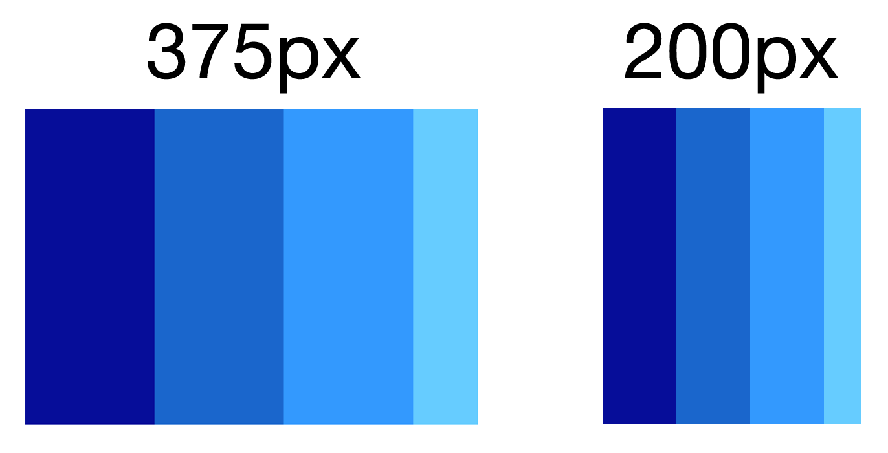
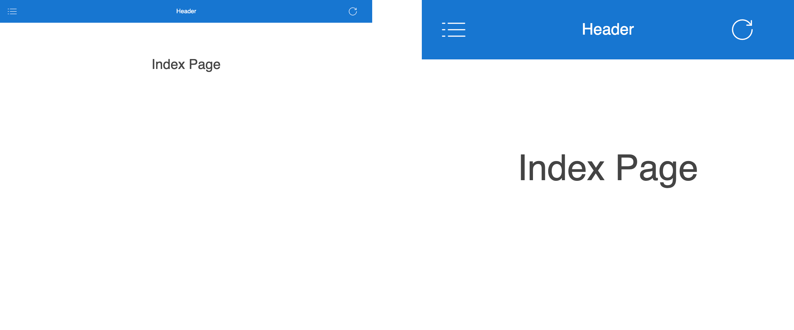
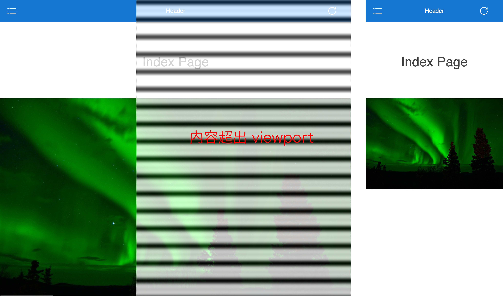
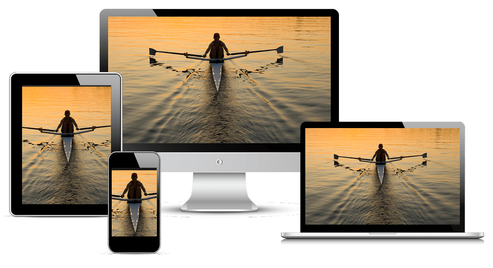

# 响应式布局

自从进入移动互联网时代，响应式布局这个词经常出现在 Web 设计和开发领域，它让 Web 页面在不同尺寸的设备上都具有良好的浏览体验。

## 开始之前

在讲解响应式布局之前，需要先了解一下基础知识，只有对它们都有一定的了解，才能在做响应式布局时选取合适的技术方案。

### 像素

像素这个单位很常见，指的是图像中最小的单位，一个不可再分割的点，在计算机屏幕上一般指屏幕上的一个光点。例如常见的描述中 iPhone X 的分辨率是 1125x2436，一般指的是在长和宽上像素点的个数。但是在 Web 开发中，我们知道 iPhone X 的像素是 375x812，那么这又是怎么回事呢？这里需要讲到设备像素（Device Pixels）和虚拟像素，也可以叫 CSS 像素（CSS Pixels）或者逻辑像素，后面我们统一使用 CSS 像素这个称呼，在 Android 开发中可以叫设备无关像素（Device Independent Pixel，简写 dip）。设备像素很好理解，对应屏幕上光点的数量。

在科技发展到今天，屏幕分辨率已经达到人眼无法区分单个像素的程度，人眼无法在 iPhone X 宽不到 7cm 的屏幕上数出 1125 个像素点。Web 开发人员眼中的 1px 可能对应多个设备像素，Peter-Paul Koch 在他的博文中有详细的讲解《[A pixel is not a pixel is not a pixel](https://www.quirksmode.org/blog/archives/2010/04/a_pixel_is_not.html)》。

比如在 iPhone X 上，设备像素是 1125x2436，而 CSS 像素是 375x812，那么一个 CSS 像素对应的是长和宽各 3 个设备像素，9个设备像素点。

    1 css pixel = 3 x 3 device pixels

那个这个比值 3 就是我们平时所说的设备像素比（Device Pixel Ratio），简称为 DPR。DPR 它并不是一个单位，而是一个比值，这个比值可以在浏览器中通过 JavaScript 代码获取。

```javascript
// 设备像素比，在 iPhone X 中等于 3，在 iPhone 6 中等于 2
window.devicePixelRatio
```

### EM vs REM

#### EM

EM 是相对单位，相对于元素自身的 `font-size`，它不像像素是固定的单位，因此很适合用来做响应式布局。

```html
<style>
h1 {
  font-size: 20px;
  margin: 1em; /* 1em = 20px */
}
p {
  font-size: 14px;
  padding: 1em; /* 1em = 14px */
}
.outer {
  font-size: 12px;
}
.inner {
  font-size: 2em;
  padding: 1em; /* 1em = 24px*/
}
</style>
<div class="outer">
  <div class="inner"></div>
</div>
```

如果当前元素没有设置 `font-size`，那么 1em 实际大小是多少？

```css
p {
  padding: 1em; /* 1em 等于多少像素*/
}
```

在上面的代码中没有设置 `<p>` 的 `font-size`，它会从继承父元素的字体大小，如果父元素也没有设置字体大小，会一直找到根元素 `<html>`，而 `<html>` 元素的默认 `font-size` 一般是 16px。有的元素有默认的字体大小，比如 `<h1>` 的 `font-size` 默认等于 2em，最终计算还是会追溯到最外层。

```html
<html>
<head></head>
<body>
  <p>1em = 16px</p>
</body>
</html>
```

#### REM

REM = Root EM，顾名思义就是相对于根元素的 EM，是根据根元素来计算出CSS 像素点的大小。根元素就是 `<html>`，而它的默认字体大小是 16px。

```css
h1 {
  font-size: 20px;
  margin: 1rem; /* 1rem = 16px */
}
p {
  font-size: 1rem; /* 1rem = 16px */
}
```

所以，如果我们改变根元素的字体大小，页面上所有使用 rem 的元素都会被重新计算元素属性并重绘。

#### EM vs REM

EM 和 REM 都是相对单位，两者都可以用来做响应式布局的单位。根据它们的特性，EM 和 REM 互有优劣。

* EM - 对于模块化的页面元素比较好，比如 Web Components 标签，标签内的元素都根据父元素计算像素大小，只需设置最外层父元素的字体大小可同时影响子元素，保持自定义元素具有一定的模块封闭性。但，EM 比较难以追溯，需要逐层向上排查显示设置了字体大小的元素。
* REM - 方便是 REM 最大的好处，只需知道 `<html>` 的字体大小即可计算当前的实际像素大小。

有的开发者全部都用 REM，有些开发者全部用 EM，这其实都是不合理的用法。开发者应该视情况不同采用不同的单位，但在现在的环境下，REM 使用的更广泛一些。

开发者根据设计师提供的 UE 图进行开发时，测量出来的大小单位一般是像素，如果需要转换为 REM，可以采用 PostCSS 的插件 `postcss-px2rem` 自动转换为 rem 单位。

### `vw`, `vh`，百分比

#### `vw` 和 `vh`

vw 和 vh 现在还不常见，但也逐渐开始被开发者使用，特别是在布局上。

* vw - viewport width，视口宽度，1vw = 1% 视口宽度
* vh - viewport height，视口高度，1vh = 1% 视口高度

vw 和 vh 的逻辑比较简单，100vw = 100% 视口宽度，视口（viewport）会在后面详细讲解。下面的代码演示如何在 iPhone X 上计算 vw 的实际 CSS 像素大小，vh 的计算方法和 vw 一样。

```html
<html>
<head>
  <meta name="viewport" content="width=device-width, initial-scale=1">
  <style>
  p {
    width: 50vw; /* 1vw = 1 / 100 * 375px = 3.75px */
  }
  </style>
</head>
<body>
  <p>50vw = 50% viewport width = 50% * 375px = 187.5px</p>
</body>
</html>
```

浏览器对 vw 和 vh 支持相对较晚，目前在 Android 4.4 以下的 Android Browser 上还不支持，但是国内主流应用的 WebView 内核都是自己定制的，内核版本都高于系统自带的，因此在国内 vw 和 vh 的支持度比 Can I Use 统计的要高很多，而且随着版本的推移，vw 和 vh 会更流行。


#### `vw`, `vh` vs 百分比

现在我们知道了，1vw = 1% 视口宽度，那么它们是不是等价呢？我们先来看一下下面的代码，同样还是以 iPhone X 为例。

```html
<html>
<head>
  <meta name="viewport" content="width=device-width, initial-scale=1">
  <style>
  .p1 {
    width: 50vw; /* 1vw = 1 / 100 * 375px = 3.75px */
  }
  .outer {
    width: 80vw;
  }
  .p2 {
    width: 50%;
  }
  </style>
</head>
<body>
  <p class="p1">50vw = 187.5px</p>
  <section class="outer">
    <p class="p2">50% = 150px</p>
  </section>
</body>
</html>
```

将上面的代码在浏览器中运行，发现第二个 `<p>` 标签的实际宽度为 150px，不是 187.5px。其实原理非常简单，就和 EM 和 REM 一样，百分比相对于父元素的宽度来计算，而 `vw` 根据视口的宽度来计算。

所以再回顾上面的例子中的第二个 `<p>` 标签，`.outer` 元素的宽度为 80vw = 300px，那么其子 `<p>` 标签的宽度为 300px * 50% = 150px。

除 vw 和 vh 外，还有 vmin 和 vmax 元素，这里就不继续展开，感兴趣的开发者可以访问 《[Fun with Viewport Units](https://css-tricks.com/fun-viewport-units/)》了解更多，这篇文章中对 vw 和 vh 讲的很详细，还有不少示例。

Web 开发中还有很多其他的单位，如 in（英尺），mm（毫米），cm（厘米）等，但因为使用的不多，开发者仅作了解就可以。

### 弹性框

上面我们讲到了百分比和 vw/vh，它们都可以用来实现响应式的布局，但是不如我们接下来要讲的弹性框灵活，它不是单位，而是一种布局方式。

区别于传统的布局方式，如标准文档流、浮动布局和定位布局，弹性框（flexbox）布局更加灵活，弹性框中的元素可以弹性伸缩，可以定义排版方向，还可以指定 flex 元素的顺序。下面是一个简单的例子。

```html
<style>
.container {
  display: flex; /* 设置容器为弹性布局 */
}
.box {
  width: 100px;
  height: 30vh;
}
.b1 {
  background: #009;
}
.b2 {
  background: #06c;
}
.b3 {
  background: #39f;
}
.b4 {
  background: #6cf;
  width: 50px;
}
</style>
<div class="container">
  <div class="box b1"></div>
  <div class="box b2"></div>
  <div class="box b3"></div>
  <div class="box b4"></div>
</div>
```

上面的例子在浏览器中的表现如下图所示，我们能看到，每个 `<div>` 元素都是横排，这是因为弹性布局默认排列为横向排列，我们可以通过 `flex-direction` 属性决定排列方向，同时在小于 350px 宽的浏览器里，会按比例自动缩小每个 `<div>` 的宽度。



从上面的例子中，能发现，有两个重要的角色需要开发者关注，一个是容器，一个是其子元素。

#### 容器样式属性

容器指的是 `display: flex` 的元素，它可以定义其他的属性，决定子元素的排列，如下。

* `flex-direction` - 定义主轴方向，即子元素的排列方向，取值为 `row`, `row-reverse`, `column` 和 `column-reverse`，默认为 `row`，即水平从左到右
* `flex-wrap` - 默认情况下，弹性布局会将所有元素都压缩到一行，可以通过设置 `flex-wrap` 告诉浏览器在适当时候换行，取值为 `nowrap`, `wrap` 和 `wrap-reverse`，默认为 `nowrap`
* `flex-flow` - 这个属性值是 `flex-direction` 和 `flex-wrap` 的简写，如 `flex-flow: row nowrap`，等价于 `flex-direction: row; flex-wrap: nowrap`
* `justify-content` - 定义子元素在主轴上对齐方式，取值为 `flex-start`, `flex-end`, `center`, `space-between`, `space-around`，默认为 `flex-start`
* `align-items` - 定义子元素在垂直于主轴的交叉轴的排列方式，取值为 `stretch`, `flex-start`, `flex-end`, `center`, `baseline`，默认为 `stretch`，即如果没设置高度，将填满交叉轴方向
* `align-content` - 定义了子元素在多条轴线上的对齐方式，如果只使用了一条轴线，那该属性不起作用，取值为 `flex-start`, `flex-end`, `center`, `space-between`, `space-between`, `space-around` 和 `stretch`，默认为 `stretch`

在弹性布局之前，开发者如果要实现子元素水平和垂直居中会比较麻烦，在弹性布局中，非常容易实现，只需要在容器上设置轴线对齐方式，如下代码所示。

```css
.container {
  display: flex; /* 设置容器为弹性布局 */
  justify-content: center; /* 设置在主轴上居中对齐 */
  align-items: center; /* 设置在交叉轴上居中对齐 */
}
```

#### 子元素样式属性

同样，子元素也有很多新增的样式属性，如下：

* `order` - 设置子元素在主轴方向上的顺序，取值为数字，从小到大排列，默认为 0
* `flex-grow` - 定义子元素的放大比例，取值为数字，默认为 0
* `flex-shrink` - 定义子元素的缩小比例，取值为数字，默认为 1
* `flex-basis` - 定义在分配多余空间之前，子元素的默认大小，默认为 `auto`
* `flex` - 是 `flex-grow`, `flex-shrink` 和 `flex-basis` 的简写，默认值为 `0 1 auto`
* `align-self` - 覆盖父元素的 `align-items` 属性，可以让子元素自身采用不同的对齐方式，默认为 `auto`，继承父元素的 `align-items`

弹性布局非常灵活，属性值也足够应对大部分复杂的场景。可以阅读这篇文章查看详细的介绍《[A Complete Guide to Flexbox](https://css-tricks.com/snippets/css/a-guide-to-flexbox/)》。

那么，开始之前需要了解的内容就到这了，接下来看如何实现响应式布局。

## 设置 viewport

支持响应式第一步，需要做的是设置页面的 `viewport`。移动端网页会在头部书写 viewport 的元标签，它告诉浏览器页面多大尺寸，是否需要缩放。

```html
<meta name="viewport" content="width=device-width, initial-scale=1">
```

想要理解 viewport 可以阅读 Peter-Paul Koch 写的三篇文章，《[A tale of two viewports — part one](https://www.quirksmode.org/mobile/viewports.html)》，《[A tale of two viewports — part two](https://www.quirksmode.org/mobile/viewports2.html)》，《[Meta viewport](https://www.quirksmode.org/mobile/metaviewport/)》。

在早期，移动设备经常需要打开 PC 端的网页，早期的移动设备设备像素比较低，多为 320px，而 PC 端的网页宽度一般都很大，所以，如果将 PC 端的网页在移动设备上打开，会因为页面太窄而导致布局错乱。为了解决这个问题，浏览器会将页面默认 viewport 设置为一个较大的值（Safari 默认是 980px），所以 PC 端的网页在移动设备浏览器上都能正常打开，只是元素看上去比较小。

在上面的例子中，viewport 的值 `width=device-width`，告诉浏览器用 屏幕宽度（单位为 CSS 像素）来作为页面宽度渲染，在 iPhone X 下是 375px，不同的设备宽度可能不一样。这个视口被 Peter-Paul Koch 称为理想视口（ideal viewport），也是体验最好的视口大小。



viewport 元标签的取值有 6 种，如下表所示

|字段名|取值|说明|
|----- |----|---|
|`width`|正整数，device-width|定义视口的宽度，单位是 CSS 像素，如果等于 device-width，则为理想视口宽度|
|`height`|正整数，device-height|定义视口的高度，单位是 CSS 像素，如果等于 device-height，则为理想视口高度|
|`initial-scale`|0 - 10|初始缩放比例，允许小数点|
|`minimum-scale`|0 - 10|最小缩放比例，必须小于等于 maximum-scale|
|`maximum-scale`|0 - 10|最大缩放比例，必须大于等于 minimum-scale|
|`user-scalable`|yes/no|是否允许用户缩放页面，默认是 yes|

## 确保内容不会超出 viewport

设置了 viewport 为理想视口，如果在 iPhone X 上，有元素的宽度超出了 375px，那么就会溢出到视口外面，导致出现横向滚动条。无论是在 PC 端，还是移动端，用户的都习惯上下滚动，而不是左右滚动，强迫用户横向滚动或者缩小页面来浏览全部的内容，体验很不好。

因此，不能期望设置 viewport 宽度能解决适配问题，还需要开发者记住以下原则。

* 不要使用大的固定宽度的元素，如果不考虑穿戴式设备，不要设置大于 320px 的宽度
* 不应该让内容在某一个特定宽度的 viewport 下才能正常显示
* 使用相对单位或者媒体查询让元素在不同大小的视口下适配

对于图片或者视频等嵌入式的元素，可以在站点 CSS 中添加下面的代码。

```css
img, embed, object, video {
  max-width: 100%; /* 设置 img 等元素最大宽度为 100% */
}
```



## 使用媒体查询

媒体查询（media query）让开发者可以有选择性的应用不同 CSS，媒体查询提供了简单的判断方法，可以根据不同的设备特征应用不同样式，比如设备的宽度、类型、方向等，可以参考 MDN 上的文档[《CSS 媒体查询》](https://developer.mozilla.org/zh-CN/docs/Web/Guide/CSS/Media_queries)。

```html
<!-- 在 viewport 宽度大于 600px 时，应用 example.css 中的样式 -->
<link ref="stylesheet" href="example.css" media="min-width: 600px">
<style>
/* 如果设备类型为屏幕并且 viewport 小于 800px 宽，设置 body 背景颜色为灰色 */
@media screen and (max-width: 800px) {
  body {
    background: #ccc;
  }
}
</style>
```

如果需要使用媒体查询应用的样式比较多，可以独立为一个文件，通过在 `<link>` 标签中设置媒体查询条件。

媒体查询支持很多设备特征，常用的主要是 viewport 的宽高和设备方向，如下表所示。

|设备特征|取值|说明|
|-------|----|----|
|`min-width`|数值，如 600px|视口宽度大于 min-width 时应用样式|
|`max-width`|数值，如 800px|视口宽度小于 max-width 时应用样式|
|`orientation`|portrait&#124;landscape|当前设备方向，portrait 垂直，landscape 水平|

如何选择 `min-width` 和 `max-width` 的取值，我们称为选择断点，主要取决于产品设计本身，没有万能媒体查询的代码。但经过实践，我们也总结了一套比较具有代表性的设备断点，代码如下。

```css
/* 很小的设备（手机等，小于 600px） */
@media only screen and (max-width: 600px) { }

/* 比较小的设备（竖屏的平板，屏幕较大的手机等, 大于 600px） */
@media only screen and (min-width: 600px) { }

/* 中型大小设备（横屏的平板, 大于 768px） */
@media only screen and (min-width: 768px) { }

/* 大型设备（电脑, 大于 992px） */
@media only screen and (min-width: 992px) { }

/* 超大型设备（大尺寸电脑屏幕, 大于 1200px） */
@media only screen and (min-width: 1200px) { }
```

如果要对细分屏幕大小进行适配，可以查看文章，列出了详细的常见设备的媒体查询条件，《[media queries for common device breakpoints](https://responsivedesign.is/develop/browser-feature-support/media-queries-for-common-device-breakpoints/)》。


## 最佳实践

### 响应式文字

大多数用户阅读都是从左到右，如果一行文字太长，用户阅读下一行时容易出错，或者用户只会读一行文字的前半部分，而略读后半部分。在上世纪就有研究表明，一行 45 ～ 90 个英文字符是最好的，当然这要看是什么字体，一个中文汉字一般对应两个英文字符，所以，对于中国用户来说，一行文字合理的数量应该是  22 ～ 45 个字符。

字体大小对阅读体验同样重要，基本字体一般不小于 16px，行高大于 1.2em。

```css
p {
  font-size: 16px;
  line-height: 1.2em; /* 1.2em = 19.2px */
}
```

而设备的尺寸多种多样，如果设计师希望在平板上将字体设置为 18px，开发者可以使用前面讲到的 REM 和媒体查询，代码如下。

```css
/* 在屏幕宽度大于 600px 的设备上使用下面的样式 */
@media only screen and (min-width: 600px) {
  p {
    font-size: 1.125rem; /* 1.125rem = 16px * 1.125 = 18px */
  }
}
```

### 响应式图片

一图胜千言，图片占网页流量消耗的 60%，可见其在 Web 的重要性。在上文提到图片不要超出视口的宽度，给图片设置 `max-width: 100%`，这确实非常有作用，那还有没有其他需要我们注意的呢。

#### 图片的质量

现代设备的 DPR (设备像素比）都很高，iPhone X 的 DPR 是 3，因此如果我们用 375px 宽的图片在 iPhone X 上显示，实际只能利用它三分之一的设备像素点，会让图片看起来很模糊，视觉体验较差。如果我们都用 3 倍分辨率的图片来显示，实际屏幕较小的设备无法完全显示如此高清晰度的图片，就会在显示时进行压缩，这对于实际屏幕比较小的设备来说会浪费较多带宽。

为此，图片质量也需要能响应式。

```html
<!-- 响应式图片 -->

```

这里 `sizes` 和 `srcset` 很多开发者比较陌生。在兼容性不好的浏览器里，会继续使用默认 `src` 属性中的图片。

**`srcset`**

定义了几组图片和对应的尺寸，格式比较简单，主要的两个部分是图片地址和图片固有宽度，单位为像素，但是这里使用 `w` 代替 `px`。

**`sizes`**

定义了一组媒体查询条件，并且指名了如果满足媒体查询条件之后，使用特定尺寸的图片。

如果开发者书写了上面代码中的图片，浏览器会根据下面的顺序加载图片。

1. 获取设备视口宽度
2. 从上到下找到第一个为真的媒体查询
3. 获取该条件对应的图片尺寸
4. 加载 `srcset` 中最接近这个尺寸的图片并显示

所以，如果我们在视口宽度为 375px 的设备上，会采用最接近 440px 的图片，`example-480w.jpg`。

如果对 `srcset` 和 `sizes` 还想了解更多，可以访问 MDN 的文档[《响应式图片》](https://developer.mozilla.org/zh-CN/docs/Learn/HTML/Multimedia_and_embedding/Responsive_images)。

#### 图片艺术方向

我们提到将图片的 `max-width` 设置为 100%，图片就会在手机屏幕上压缩到视口的宽度，如果这张图片实际上很大，图片中的内容就会看不清，特别是如果图片主要内容集中在中间，如人像，浏览效果会比较差。遇到这样的情况，最好的方式是在不同的屏幕尺寸下采用不同的图片，让主要内容保持在视口中间，如下图。



HTML 标准中有一个标签 `<picture>`，允许我们在其中设置多个图片来源，就和 `<video>`，`<audio>` 标签一样。

```html
<picture>
  <source media="(max-width: 799px)" srcset="example-480w-portrait.jpg">
  <source media="(min-width: 800px)" srcset="example-800w.jpg">
  
</picture>
```

`<picture>` 标签的作用和上面在 `` 中设置 `sizes` 和 `srcset` 一样，都能在不同的设备宽度下显示不同的图片，笔者更建议使用 `<picture>` 实现此效果。

#### 图片的其他注意事项

响应式布局在 PWA 中是非常重要的概念，在实现响应式的同时，还需要关注响应式图片是否会带来性能问题。在开发过程中，还需要注意下面几个问题。

1. 对图片进行懒加载
2. 对于小的简单的图片，可以使用矢量图或者字体，保证在不同尺寸设备下都很清晰
3. 对于尺寸小的图片，可以使用 Data URI 的方式，将图片转成 base64 内联在 CSS 或者 HTML 中，避免请求，但这样同样无法利用 HTTP 缓存，因此一般只对小于 1.5K 的图片做处理
4. 挑选恰当的图片格式，PNG，JPEG 等，可以在 Android 下使用 WebP 格式
5. 对图片进行压缩和优化
6. 采用 CSS 和 CSS 动画代替一些简单的图片和动态图，如加载中 GIF 图

### 响应式布局

利用相对单位、flexbox、媒体查询等技术，开发者能应付各种类型的页面和布局，为了方便开发者能够快速上手，下面介绍 5 种常见的响应式布局模式。这些模式最初由 [Luke Wroblewski](https://www.lukew.com/ff/entry.asp?1514) 总结并提出。

为了更好的理解这些响应式布局，笔者准备了 5 个例子。

```bash
# 从 GitHub 下载代码到本地 pwa-book-demo 目录
$ git clone https://github.com/lavas-project/pwa-book-demo.git

# 进入到 chapter02/responsive-web-design 目录
$ cd chapter02/responsive-web-design

# 安装 npm 依赖
$ npm install -g edp

# 启动 chapter02 responsive-web-design 示例
$ edp ws start
```

启动完成之后，访问 `http://localhost:8848/` 能看到 5 个不同的目录，如 mostly-fluid，点击目录里的 `index.html` 就能看到不同模式的效果，尝试拖动改变浏览器的大小吧。

#### 第一种：大体流动（Mostly Fluid）

大体流动布局的主要特点是在大屏幕上，内容区域宽度是固定的，因此在多数设备上，主要布局结构并没有很大改变，如果屏幕宽度大于内容区域，就在内容左右留白。而在视窗宽度较窄时，会逐渐掉落呈堆放，如下图所示。


大体流动布局比较简单，往往只需要少量的媒体查询就可以实现，如下代码所示。

```html
<style>
.box {
  width: 100%;
  height: 150px;
}
/* 设置各个区块的颜色 */
.b1 {
  background: #009;
}
.b2 {
  background: #06c;
}
.b3 {
  background: #39f;
}
.b4 {
  background: #6cf;
}
.b5 {
  background: #cff;
}
/* 在大于 450px 时，将 .b2, .b3 宽度设置为 50% */
@media screen and (min-width: 450px) {
  .b2, .b3 {
    width: 50%;
  }
}
/* 在大于 800px 时，将 .b1, .b2 宽度设置为 50%，让 .b3, .b4, .b5 平分一行 */
@media screen and (min-width: 800px) {
  .b1, .b2 {
    width: 50%;
  }
  .b3, .b4, .b5 {
    width: 33.333333%;
  }
}
/* 定义最大宽度为 980px */
@media screen and (min-width: 980px) {
  .container {
    max-width: 980px;
    margin: auto;
  }
}
</style>
...
<div class="container">
  <div class="box b1"></div>
  <div class="box b2"></div>
  <div class="box b3"></div>
  <div class="box b4"></div>
  <div class="box b5"></div>
</div>
```

#### 第二种：列掉落 （Column Drop）

列掉落，布局中的每列随着宽度变小而逐个掉落，在视口最小的时候，每个元素都纵向堆放。和大体流动布局不同点在于，列掉落布局不会设置最大宽度，如果视口足够大，列掉落布局也会填满整个页面。媒体查询的断点选择需要根据网页本身的内容来选择。


列掉落比大体流动布局要简单，代码如下。

```html
<style>
/* 在大于 450px 时，将 .b1 和 .b2 放置在同一行，分别占据 30% 和 70% */
@media screen and (min-width: 450px) {
  .b1 {
    width: 30%;
  }
  .b2 {
    width: 70%;
  }
}
/* 在大于 800px 时，.b1, .b3 各占 20% 区域，.b2 在中间占 60% */
@media screen and (min-width: 800px) {
  .b1, .b3 {
    width: 20%;
  }
  .b2 {
    width: 60%;
  }
}
</style>
...
<div class="container">
  <div class="box b1"></div>
  <div class="box b2"></div>
  <div class="box b3"></div>
  <div class="box b4"></div>
  <div class="box b5"></div>
</div>
```

#### 第三种：布局移位（Layout Shifter）

布局移位是最灵活的布局方式，它不仅仅将元素按照从前到后，从上到下排列，有时还会改变元素的位置。


代码如下：

```html
<style>
/* 在大于 800px 时，将 .b1 和 .b4 放置在同一行，分别占据 20% 和 80% */
@media screen and (min-width: 800px) {
  .b1 {
    width: 20%;
  }
  .b4 {
    width: 80%;
  }
}
</style>
...
<div class="container">
  <div class="box b1"></div>
  <div class="box b4">
    <div class="box b2"></div>
    <div class="box b3"></div>
  </div>
</div>
```

#### 第四种：微调（Tiny Tweaks）

微调，意思就是在视口发生变化时，对内容进行一些小的调整，比如调整字体、图片大小或者元素间距等。


```html
<style>
.b1 {
  background: #39f;
  text-align: center;
  padding-top: 10%;
  font-size: 1em;
}
@media screen and (min-width: 450px) {
  .b1 {
    font-size: 2em;
  }
}
@media screen and (min-width: 800px) {
  .b1 {
    font-size: 4em;
  }
}
</style>
...
<div class="container">
  <div class="box b1">字体大小</div>
</div>
```

#### 第五种：画布溢出（Off Canvas）

在画布溢出布局中，内容不是从上到下的，而是将不常用的内容，比如应用菜单和导航栏，折叠起来，留下一个打开的入口，只有当屏幕足够大的时候才显示。画布溢出布局很常见，不仅在 Web App 中，在 Native App 中使用更多。这样的布局一般都需要配合 JavaScript 使用。


在示例中，我们通过 `transform: translate(-275px, 0)` 将左侧侧边栏隐藏在视口外，点击菜单后，菜单栏会从左侧划出。在页面视口大于 800 时，将布局改为 `flexbox` 弹性布局，直接显示左侧菜单栏，代码如下。

```html
<style>
  nav {
    width: 275px;
    height: 100%;
    position: absolute;
    /* 将菜单栏隐藏起来 */
    transform: translate(-275px, 0);
    transition: transform 0.3s ease-in-out;
    background: #39f;
    z-index: 2;
  }
  nav.open {
    transform: translate(0, 0);
  }
  /* 在视口大于 800px 时，将菜单栏直接显示出来 */
  @media screen and (min-width: 800px) {
    nav {
      position: relative;
      transform: translate(0, 0);
    }
    body {
      display: flex;
      flex-flow: wrap;
    }
    main {
      width: auto;
      flex: 1;
    }
  }
</style>
<nav></nav>
<main>
  <a id="menu">...</a>
</main>
<div id="mask"></div>
<script>
  let mask = document.querySelector('#mask')
  let nav = document.querySelector('nav')
  let menu = document.querySelector('a')

  // 点击菜单，显示或隐藏菜单栏
  menu.addEventListener('click', event => {
    nav.classList.toggle('open')
    mask.classList.toggle('open')
  })
  // 点击遮罩，隐藏菜单栏
  mask.addEventListener('click', event => {
    nav.classList.remove('open')
    mask.classList.remove('open')
  })
</script>
```

以上就是比较常见的 5 种响应式布局模式，大多数情况下都需要多种模式同时使用。

## 总结

响应式布局从设计角度出发，借助视口设置、CSS 媒体查询等方法，使开发者可以更易于维护适用于不同尺寸屏幕的网页。在本节中，我们介绍了一些文字、图片以及布局方面常见的响应式设计最佳实践，开发者应用这些经验，可以更好的优化 PWA 在不同尺寸大小设备的用户体验。

