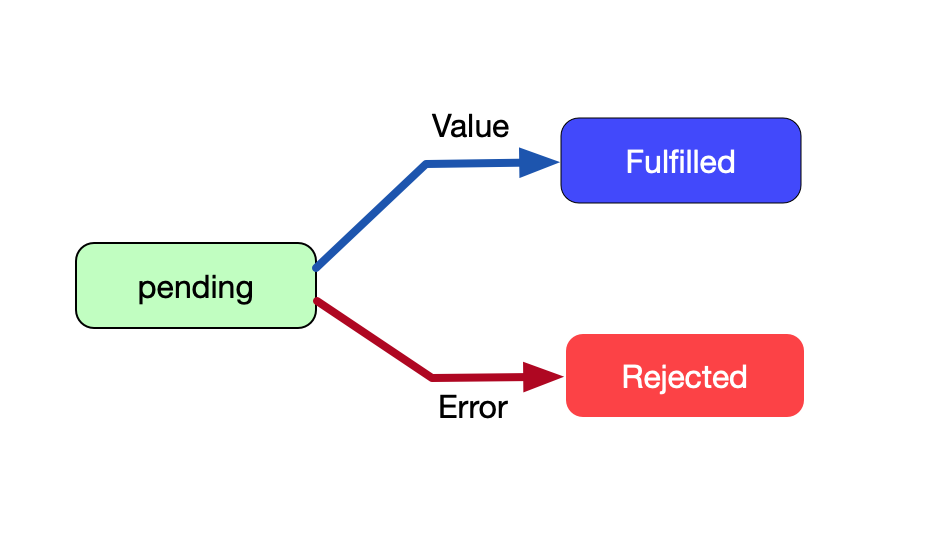

# Promise

在深入介绍 Service Worker 之前，先来简单了解一下 Promise API，因为 Service Worker 的所有的接口内部都是采用 Promise 实现，如果对 Promise 不了解的话理解起来会比较吃力，当然，如果对 Promise 非常了解的读者可以跳过这部分的介绍。

## 什么是 Promise

Promise 可以做很多事情。但现在只需要知道，如果有什么返回了一个 Promise 对象，那就可以在后面加上 `.then()` 来传入 Promise 内的逻辑执行成功和失败的回调函数。也可以在后面加上 `.catch()` 如果你想添加一个 Promise 内逻辑执行失败的回调函数。

如果在 JavaScript 中存在异步操作，以前通常是采用回调的方式来实现，假设现有一个异步操作的 `requestAsync()` 方法用来发送异步请求，如下代码所示：

```js
requestAsync('/some/path', (err, result) => {
  if (err) {
    // 请求失败的时候
    throw err
  }
  // 请求成功的时候
  console.log(result)
})
```

如果这样的回调函数多几层的话，比如异步操作依赖另一个异步操作的结果，那这样的代码看起来会是一团糟。而 Promise 可以把类似的异步处理对象和处理规则进行精简并规范化，并按照采用统一的接口来编写，而采取规定方法之外的写法都会出错，比如上面的异步操作可以采用 Promise 的写法改写，代码如下所示：

```js
let promise = requestAsyncPromise('/some/path')

promise.then(result => {
  // 请求成功时的处理
  console.log(result)
}).catch(err => {
  // 请求失败时的处理
})
```

也就是说，除 Promise 对象规定的方法（如这里的 `.then()` 或 `.catch()`）以外的方法都是不可以使用的，而不会像异步回调函数方式那样可以自己自由地定义回调函数的参数。Promise 必须严格遵守固定、统一的编程方式来编写代码。这样基于 Promise 的统一接口的做法，就可以处理各种各样的异步操作了。所以 Promise 的功能是可以将复杂的异步处理轻松地进行固定模式化，这也可以说得上是使用 Promise 的理由之一。

## Promise 简介

在 ES6 Promises 标准中定义的 promise 对象大致有三种类型：`构造函数型`、`实例方法型`、`静态方法型`。

### 构造函数型

可以从 Promise 构造函数中直接来创建一个新 promise 对象。可以使用 `new` 操作来调用 Promise 的构造器来进行实例化，如下代码所示：

```js
let promise = new Promise((resolve, reject) => {
  // 异步处理
  // 处理结束后、调用 resolve 或 reject
  if (/*处理成功*/) {
    resolve('promise 成功')
  } else {
    reject('promise 失败')
  }
})
```

### 对象方法型

对于通过 `new` 操作实例化的 promise 对象，通过 `promise.then()` 实例方法可以指定其后续执行的回调函数，如下代码所示：

```js
promise.then(onFulfilled, onRejected)
```

- resolve 时 onFulfilled 会被调用
- reject 时 onRejected 会被调用

onFulfilled、onRejected 两个都为可选参数。

`promise.then()` 在成功和失败时都可以使用。另外在只想对异常进行处理时可以采用 `promise.then(undefined, onRejected)` 这种方式，只需要指定 reject 时的回调函数即可。当然这种情况还是使用更加规范的 `promise.catch(onRejected)` 比较好。

### 静态方法型

像 Promise 这样的全局对象还拥有一些静态方法。例如 `Promise.all()`，还有 `Promise.resolve()` 等在内，主要都是一些对 Promise 进行操作的辅助方法，其返回的都是 promise 对象。

## Promise 状态

通过前面的介绍大概了解了 Promise 的处理流程，接下来再了解一下 Promise 的状态。

用 `new Promise()` 实例化的 promise 对象有以下三个状态。

- Fulfilled：resolve 时。此时会调用 onFulfilled。
- Rejected：reject 时。此时会调用 onRejected。
- Pending：既不是 resolve 也不是 reject 的状态。也就是 promise 对象刚被创建后的初始化状态等。

图 4-3 展示了 Promise 三种状态之间的关系：



promise 对象的状态从 Pending 转换为 Fulfilled 或 Rejected 之后，这个 promise 对象的状态就不会再发生任何变化。也就是说，Promise 与 Event 等不同，在 `.then()` 后执行的函数可以肯定地说只会被调用一次。另外，Fulfilled 和 Rejected 这两个中的任一状态都可以表示为 Settled（不变的）。
