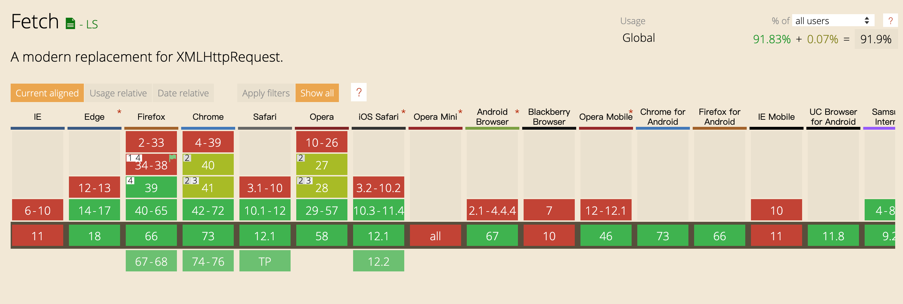

# Fetch API

Fetch API 是目前最新的异步请求解决方案，它在功能上与 XMLHttpRequest（XHR）类似，都是从服务端异步获取数据或资源的方法。对于有过 AJAX 开发经验的读者应该深有体会，基于 XHR 的异步请求方法在实现上比较复杂。下面简单演示如何通过 XHR 发送异步请求：

```js
// 实例化 XMLHttpRequest
let xhr = new XMLHttpRequest()
// 定义加载完成回调函数，打印结果
xhr.onload = function () {
  console.log('请求成功')
}
// 定义加载出错时的回调函数，打印错误
xhr.onerror = function (err) {
  console.error('请求失败')
}
// 设置请求目标
xhr.open('GET', '/path/to/text', true)
// 开始发起请求
xhr.send()
```

从上面的代码当中可以感受到，基于事件回调机制的 XHR 在编程实现的思路上非常反思维，要实现这样一个简单的 GET 请求所需代码较多，一旦功能变得复杂很容易会造成混乱。因此在实际应用当中，一般会选择封装好的函数进行使用，比如较为常见的是 jQuery 所提供的 $.ajax 方法。

接下来使用 Fetch API 来实现上述功能：

```js
fetch('/path/to/text', {method: 'GET'})
  .then(response => {
    console.log('请求成功')
  })
  .catch(err => {
    console.error('请求失败')
  })
```

经过对比可以发现，在使用 Fetch API 之后，代码逻辑变得更清晰，所需的代码也变得更少。当然 Fetch API 的优点还不止这些，在本节的内容当中，将逐步对 Fetch API 进行更加深入的学习。

## 兼容性

Fetch API 的标准目前由 WHATWG 组织进行制定与维护，虽然尚未纳入 W3C 规范当中，但从 Can I Use 网站的统计数据来看，各大主流浏览器已经基本上实现了对 Fetch API 的支持。



对于尚未支持或支持度不完整的浏览器，开源社区也提供了相关 Polyfill，开发者可以通过 npm 进行安装和使用：

```shell
npm install --save whatwg-fetch
```

安装完成之后，只需在 JS 入口文件引入 Polyfill 即可：

```js
import 'whatwg-fetch'
// 引入 polyfill 之后，就可以正常使用 Fetch API 了
window.fetch(/* 相关参数 */)
```

对于不使用 npm 的项目，也可以到 whatwg-fetch 的 [GitHub 主页](https://github.com/github/fetch)直接下载并使用 fetch.umd.js 文件。

## 概念和用法

Fetch API 首先提供了网络请求相关的方法 `fetch()`，其次还提供了用于描述资源请求的 Request 类，以及描述资源响应的 Response 对象，这样就能够以一种统一的形式将资源的请求与响应过程应用到更多的场景当中。

### fetch()

Fetch API 提供了 `fetch()` 用来发起网络请求并获得资源响应。它的使用方法非常简单，相关语法如下所示：

```js
fetch(request).then(response => {/* 响应结果处理 */})
```

可以看到，`fetch()` 需要传入一个 Request 对象作为参数，`fetch()` 会根据 request 对象所描述的请求信息发起网络请求；由于网络请求过程是个异步过程，因此 `fetch()` 会返回 Promise 对象，当请求响应时 Promise 执行 resolve 并传回 Response 对象。

除了直接以 Request 对象作为参数之外，`fetch()` 还支持传入请求 URL 和请求配置项的方式，`fetch()` 会自动根据这些参数实例化 Request 对象之后再去发起请求，因此以下代码所展示的请求方式都是等价的：

```js
fetch(new Request('/path/to/resource', {method: 'GET'}))
// 等价于
fetch('/path/to/resource', {method: 'GET'})
```

需要注意的是，`fetch()` 只有在网络错误或者是请求中断的时候才会抛出异常，此时 Promise 对象会执行 reject 并返回错误信息。因此对于 `fetch()` 来说，服务端返回的 HTTP 404、500 等状态码并不认为是网络错误，因此除了检查 Promise 是否 resolve 之外，还需要检查 Response.status、Response.ok 等属性以确保请求是否成功响应。下面的示例代码通过检查响应 status 是否为 200 来判断请求是否成功：

```js
fetch('/path/to/resource').then(response => {
  if (response.status === 200) {
    // 请求成功
  } else {
    // 请求失败
  }
})
.catch(err => {
  // 网络请求失败或请求被中断
})
```

### Request

Request 是一个用于描述资源请求的类，通过 Request() 构造函数可以实例化一个 Request 对象，其语法如下所示：

```js
let request = new Request(input, init)
```

其中，input 代表想要请求的资源，可以是资源的 URL，或者是描述资源请求的 Reqeust 对象；init 为可选参数，可以用来定义请求中的其他选项。可以注意到，Request 构造函数所需参数与 `fetch()` 方法的参数是一样的。下面将通过一些例子来演示一些常见请求类型的实例化方法：

1.GET 请求，请求参数需要写到 URL 当中。

```js
let getRequest = new Request('/api/hello?name=lilei', {
  method: 'GET'
})
```

2.POST 请求，请求参数需要写到 body 当中。

```js
let postRequest = new Request('/api/hello', {
  method: 'POST',
  // body 可以是 Blob、FormData、字符串等等
  body: JSON.stringify({
    name: 'lilei'
  })
})
```

3.自定义请求的 Headers 信息。

```js
let customRequest = new Request('/api/hello', {
  // 这里展示请求 Content-Type 为 text/plain 的资源
  headers: new Headers({
    'Content-Type': 'text/plain'
  })
})
```

4.设置发起资源请求时带上 cookie。

```js
let cookieRequest = new Request('/api/hello', {
  credentials: 'include'
})
```

init 对象还可以配置其他参数，此处先不做展开，在后续的内容当中会针对一些特定参数做进一步说明。

由于在后面实现资源请求的拦截代理时，需要对拦截的请求进行判断分类，也就是对 Request 对象的属性进行检查，因此介绍一下 Request 对象常用的几个属性：

- url：String 类型，只读，请求的 url；
- method：String 类型，只读，请求的方法，如 'GET'，'POST' 等；
- headers：Headers 类型，只读，请求的头部，可通过 get() 方法获取 'Content-Type'，'User-Agent' 等信息。

下面举例使用以上属性对请求进行判断：

```js
if (request.url === 'https://example.com/data.txt') {
  // ...
}
if (request.method === 'POST') {
  // ...
}
if (reuqest.headers.get('Content-Type') === 'text/html') {
  // ...
}
```


### Response

Response 类用于描述请求响应数据，通过 Response() 构造函数可以实例化一个 Response 对象，其实例化语法如下所示：

```js
let response = new Response(body, init)
```

其中 body 参数代表请求响应的资源内容，可以是字符串、FormData、Blob 等等；init 为可选参数对象，可用来设置响应的 status、statusText、headers 等内容。下面举例说明如何构造一个 index.js 的响应：

```js
let jsResponse = new Response(
  // index.js 的内容为，在控制台打印 "Hello World!"
  'console.log("Hello World!")',
  {
    // 定义状态码为请求成功
    status: 200,
    // 通过 headers 定义 JS 的 Content-Type
    headers: new Headers({
      'Content-Type': 'application/x-javascript'
    })
  }
)
```

在实际应用当中，我们一般会通过 `fetch()`、Cache API 等等获得请求响应对象，然后再对响应对象进行操作。

#### 判断请求是否成功

前面在介绍 `fetch()` 时提到，对于服务端返回 HTTP 404、500 等错误码 `fetch()` 不会将其当成网络错误，这时就需要对 Response 对象的相关属性进行检查。

- status：Number 类型，包含了 Response 的状态码信息，开发者可以直接通过 status 属性进行状态码检查，从而排除服务端返回的错误响应；
- statusText：String 类型，包含了与状态码一致的状态信息，一般用于解释状态码的具体含义；
- ok：Boolean 类型，只有当状态码在 200-299 的范围时，ok 的值为 true。

除了上述提到的属性之外，也同样可以借助 headers 等属性进行辅助判断，具体检查方式与实际需求有关。下面举例如何使用 ok 和 status 进行判断：

```js
if (response.ok || response.status === 0) {
  // status 为 0 或 200-299 均代表请求成功
} else {
  // 请求失败
}
```

#### 读取响应体

Fetch API 在设计的时候就采用了数据流的形式去操作请求体和响应体，这样在传输大数据或大文件时会非常有优势。Response 的 body 属性暴露了一个 ReadableStream 类型的响应体内容。Response 提供了一些方法来读取响应体：

- text()：解析为字符串；
- json()：解析为 JSON 对象；
- blob()：解析为 Blob 对象；
- formData()：解析为 FormData 对象；
- arrayBuffer()：解析为 ArrayBuffer 对象

这些方法读取并解析响应体的数据流属于异步操作，因此这些方法均返回 Promise 对象，当读取数据流并解析完成时，Promise 对象将 resolve 并同时返回解析好的结果。下面的示例将简单演示如何读取 JSON 格式的响应体：

```js
// 构造 Response 对象
let response = new Response(JSON.stringify({name: 'lilei'}))

// 通过 response.json() 读取请求体
response.json().then(data => {
  console.log(data.name) // 打印 'lilei'
})
```

由于 Response 的响应体是以数据流的形式存在的，因此只允许进行一次读取操作。通过检查 bodyUsed 属性可以知道当前的 Response 对象是否已经被读取：

```js
let response = new Response(JSON.stringify({name: 'lilei'}))

console.log(response.bodyUsed) // false

response.json().then(data => {
  console.log(response.bodyUsed) // true
})
```

由于二次读取响应体内容会导致报错，因此为了保险起见，可以在进行响应体读取前首先判断 bodyUsed 属性再决定下一步操作。

#### 拷贝 Response

Response 提供了 clone() 方法来实现对 Response 对象的拷贝：

```js
let clonedResponse = response.clone()
```

clone() 是一个同步方法，克隆得到的新对象在所有方面与原对象都是相同的。在这里需要注意的是，如果 Response 对象的响应体已经被读取，那么在调用 clone() 方法时会报错，因此需要在读取响应体读取前进行克隆操作。

## Fetch API 与 XHR 的对比

通过上面的介绍可以发现，从功能上看，Fetch API 和 XHR 做的事情都是相似的，都实现了异步请求与资源获取。但从 API 的具体使用和实现方式上，两者存在着较大区别：

1.Fetch API 的异步机制更为先进

XHR 采用回调机制实现异步，这种机制不太符合人脑线性的思维方式，在较为复杂的异步场景中如果存在大量的回调，很容易带来代码可读性差的问题。当然我们也可以利用 Promise 将 XHR 包装成返回 Promise 对象的函数来解决上述问题，但这种封装的函数毕竟不如原生方法来得简洁。

Fetch API 则直接采用 Promise 实现异步机制，通过链式调用 Promise.then() 方法，就能够直接按照线性的思维去组织异步操作中的每个步骤，同时借助 Promise.all、Promise.race 等方法，还能够高效地组织多个异步操作来实现更为复杂的功能。

2.Fetch API 更为简洁

在使用 XHR 进行异步请求时会发现，XHR 实例属性包含了请求描述、响应描述，以及各种事件、请求操作方法等等，显得相当混乱。

Fetch API 在设计的时候不仅仅实现了 `fetch()` 这个方法，还根据异步请求中所需要的数据格式拆分出 Request、Response、Headers、Body 等一系列原生对象，彼此各司其职，符合关注点分离原则，因此在使用上会显得更加简洁，更加语义化。

3.Fetch API 的应用范围更广

目前 XHR 已经无法在 Service Worker 作用域下进行使用，在 Service Worker 作用域当中发起异步请求的方法只有 Fetch API。这也许只是个开始，XHR 在过去已经很好地完成它的历史使命，但由于 XHR 在设计上已经逐渐不适应现代编程理念，因此在未来 XHR 的应用范围将可能会变得越来越窄，而 Fetch API 这类基于新理念和新技术所设计的 API 将逐渐发挥出越来越重要的作用。

## Fetch API 处理跨域请求

当涉及到前后端通信问题的时候，就不得不提请求跨域的情况。由于受到 Web 同源策略的影响，在使用 Fetch API 默认配置情况下发送异步请求，会受到跨域访问限制而导致资源请求失败。

我们通常采用跨域资源共享机制（CORS）来解决这个问题。在跨域服务端支持 CORS 的前提下，通过将 `fetch()` 的请求模式设置为“cors”，就可以简单地实现跨域请求。在这种请求模式下，返回的请求响应是完全可访问的：

```js
// 假设当前页面 URL 为 https://current.com
fetch('https://other.com/data.json', {
  mode: 'cors'
})
.then(response => {
  console.log(response.status) // 200
  console.log(response.type) // 'cors'
  console.log(response.bodyUsed) // false
  return response.json()
})
.then(data => {
  console.log(data.name) // 'lilei'
})
```

对于图片、JS、CSS 等等这些类型的静态资源，如果通过对应的 HTML 标签加载这类跨域资源，是不会受到同源策略限制的，因此一般来说，存放静态资源的服务器并不需要设置 CORS。这就会对 Fetch API 请求这类静态资源带来影响。在默认情况下 `fetch()` 的请求模式为“no-cors”，在这种模式下请求跨域资源并不会报错，但是返回的 Response 对象将变得不透明，type 属性将变成“opaque”，无论服务端所返回的真实 status 是多少，在这种情况下都会变成 0，其他属性也都无法正常访问：

```js
// 假设当前页面 URL 为 https://current.com
fetch('https://other.com/data.json', {
  mode: 'no-cors'
})
.then(response => {
  console.log(response.status) // 0
  console.log(response.type) // 'opaque'
  console.log(response.headers) // Headers {}
  console.log(response.body) // null
})
```

此时唯一能正常工作的方法是 clone()，即实现对 Response 对象的拷贝，当然拷贝得到的新对象也同样是不透明的。这种模式比较适用于在 Service Worker 线程中拦截静态资源请求并复制一份缓存到本地，只要将这类不透明的请求响应返回主线程，依然是能够正常工作的。下面的代码演示了 Service Worker 拦截跨域图片资源并将资源缓存到本地，然后在 `fetch()` 出错的时候再从缓存中读取资源：

```js
// service-worker.js

self.addEventListener('fetch', event => {
  // 判断当前拦截到的请求为跨域图片资源
  if (event.request.url === 'https://other-site.com/pic.jpg') {
    event.respondWith(
      // 优先发送网络请求获取最新的资源
      fetch(event.request.url, {mode: 'no-cors'})
        .then(response => {
          // 将请求得到的响应进行缓存
          // 此时缓存的资源是不透明的
          caches.open('cache-storage')
            .then(cache => cache.put(event.request.url, response.clone()))
          // 返回请求响应结果
          return response
        })
        .catch(
          // 请求失败时再使用缓存资源进行兜底
          () => caches.open('cache-storage')
            .then(cache => cache.match(event.request.url))
        )
      )
    )
  }
})
```

在这种情况下，图片资源的 Response 对象是不透明的，因此整个操作过程无法对图片资源响应做任何检查判断，只能直存直取。这就有可能将真实状态码为 404、500 等错误响应给缓存下来，因此在“no-cors”模式下缓存的跨域资源的可信度不高，最好作为各类请求策略的兜底资源进行使用。

