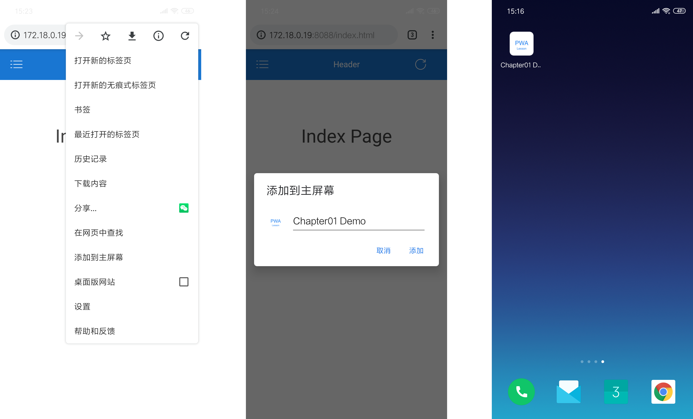
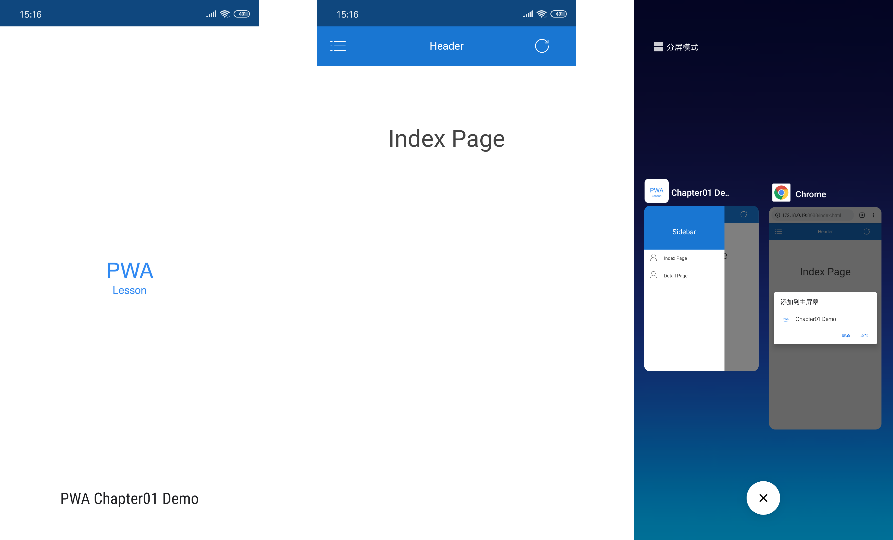
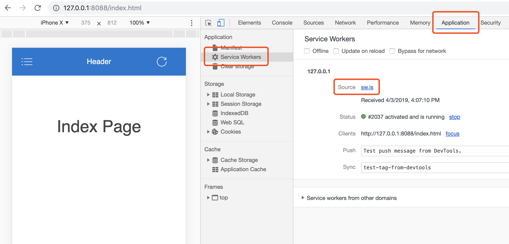

# 你的第一个 PWA

本书中大部分示例均基于下面的这个模板展开，开发者可以跟随书中示例逐步操作，加深理解。在这个示例里，我们一起来实现一个能添加到桌面并且离线可用的 PWA。

## 准备工作

在准备编写第一个 PWA 前，有一些准备工作需要准备，需要安装一些必备的软件，如下：

* 一台可以正常联网的计算机并已安装较新版本的 Node.js，npm，Git
* 一个方便调试并支持 Service Worker 的浏览器，推荐使用 Google Chrome
* 一部安卓手机，开启添加到桌面的权限，推荐安装好 Chrome 浏览器
* 一个自己习惯的文本编辑器，如 Visual Studio Code, Sublime Text 等等

## 下载代码

在完成上面的准备工作后，接下来下载笔者准备的示例代码。本书的示例代码均托管在 GitHub 上，地址是 [https://github.com/lavas-project/pwa-book-demo](https://github.com/lavas-project/pwa-book-demo)。

> 本书所有的 JS 代码均符合 [JavaScript Standard Style](https://standardjs.com/) 规范。

那么接下来的第一步，我们先下载代码到本地，在命令行中运行如下命令。

```bash
# 从 GitHub 下载代码到本地 pwa-book-demo 目录
$ git clone https://github.com/lavas-project/pwa-book-demo.git

# 进入到 chapter01 目录
$ cd chapter01

# 安装 npm 依赖
$ npm install

# 安装成功后启动 chapter01 示例
$ npm run server
```

在看到命令行中输出 `Server start on: http://127.0.0.1:8088`，意味着已经成功启动，这时，打开浏览器，访问 `http://127.0.0.1:8088` 能看到如下图所示的页面。


接下来，开发者可以根据下面的步骤逐步开启 Web App Manifest 和 Service Worker，开始体验自己的第一个 PWA。

## 添加到主屏

根据前面的章节介绍，增加用户黏性最好的方式是把这个 PWA 放在用户的主屏上，它背后的技术就是 Web App Manifest，接下来，我们就来看看如何使用。

第一步，站点需要新增一个文件：`manifest.json`，这个文件中包含站点的名称、图标地址、入口地址、显示模式等信息，并且通过一个地址能够访问到该文件，在我们下载下来的代码中，这个文件在 `chapter01/public/` 目录下，启动调试服务器后，可以通过 `http://127.0.0.1:8088/manifest.json` 访问到。

```json
{
  "name": "PWA Chapter01 Demo",
  "short_name": "Chapter01 Demo",
  "icons": [
    {
      "src": "assets/images/icons/icon_144x144.png",
      "sizes": "144x144",
      "type": "image/png"
    },
    {
      "src": "assets/images/icons/icon_152x152.png",
      "sizes": "152x152",
      "type": "image/png"
    },
    {
      "src": "assets/images/icons/icon_192x192.png",
      "sizes": "192x192",
      "type": "image/png"
    },
    {
      "src": "assets/images/icons/icon_512x512.png",
      "sizes": "256x256",
      "type": "image/png"
    }
  ],
  "start_url": "/index.html",
  "display": "standalone",
  "background_color": "#fff",
  "theme_color": "#1976d2"
}
```

第二步，在 HTML 页面中添加对 `manifest.json` 文件的引用，在示例中，打开 `chapter01/public/index.html` 文件，添加如下代码到 `<head>` 中。

```html
<!-- chapter01/public/index.html -->
<!-- 对 manifest.json 的应用 -->
<link rel="manifest" href="./manifest.json">
```

第三步，在移动端浏览器 Chrome 中打开启动的地址，如果在同一个局域网内，可以通过电脑的 IP 地址访问，比如笔者的电脑的局域网 IP 是 `192.168.0.100`，那么就可以通过 `http://192.168.0.100:8088/` 访问。访问成功后，点击添加到桌面按钮，PWA 就会出现在主屏上，如下图所示。



点击 PWA 的图标，不仅具有启动画面，还具有完全沉浸式的体验，如下图所示。



Web App Manifest 的内容远不止这些，可以阅读本书的后续章节，会详细介绍。

> 如果添加到主屏始终不成功，可以阅读本书的第五章，相信会解决您的问题。

## 离线可用

离线可用依赖于 Service Worker 的应用，接下来来看看在示例代码中如何启用 Service Worker。

第一步，您需要一个 Service Worker 文件，在示例中，可以查看 `chapter01/public/sw.js` 文件，并且可以通过 `http://127.0.0.1:8088/sw.js` 访问到该文件，sw.js 文件具体的内容会在后续章节逐步讲解。

第二步，在 HTML 页面中注册 Service Worker。打开 `chapter01/public/index.html` 文件，找到下面的代码，并将注释打开。

```html
<!-- service worker -->
<script>
  // 判断浏览器是否支持 Service Worker
  if ('serviceWorker' in navigator) {
    // 在 load 事件触发后注册 Service Worker，确保 Service Worker 的注册不会影响首屏速度
    window.addEventListener('load', function () {
      // 注册 Service Worker
      navigator.serviceWorker.register('/sw.js').then(function (registration) {
        // 注册成功
        console.log('ServiceWorker registration successful with scope: ', registration.scope)
      }).catch(function (err) {
        // 注册失败 :(
        console.warn('ServiceWorker registration failed: ', err)
      })
    })
  }
</script>
```

第三步，接下来可以通过打开电脑上的 Chrome 来验证是否注册成功，并且是否离线可用。

通过 Chrome 访问 `http://127.0.0.1:8088` 打开我们的第一个 PWA，并且打开调试工具，点击 `Application` 菜单栏，再点击调试工具左边的 Service Worker 选项，会看到 `sw.js` 的注册信息，如下图所示：



那么，我们检查一下是否真的离线可用，勾选上图中的 `Offline` 复选框，让 Chrome 在这个标签页下保持断网状态。


接下来，刷新页面，您会发现页面依然能正常渲染，这就是 PWA 的离线可用，可以利用 Service Worker 做很多事情，缓存页面框架和骨架屏，提升页面首屏速度，甚至可以缓存部分数据。Service Worker 将在本书的后续章节会重点讲述。

## 总结

以上就是您的第一个 PWA，麻雀虽小，五脏俱全，能被添加到主屏，能离线可用，短短的几行代码就在原站点的基础上实现了这两个功能，并且没有侵入性，代价也很小，它确实奉行渐进式的原则。
