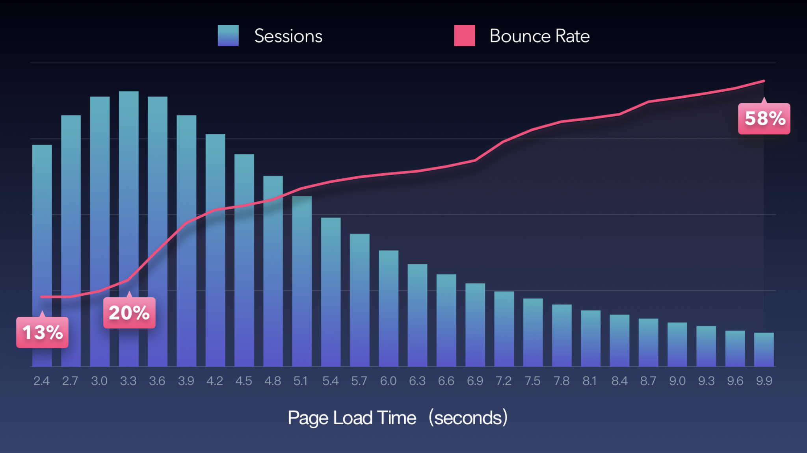

# 设计与技术

好的设计没有好的技术来实现同样无法达到最佳的用户体验。

设计与技术并不只是实现的关系，而是需要互相配合，再完美的设计如果不能实现，那也只是白费，而一些技术上的优化也需要设计给予配合才能更加完美。

上一节中，列出了很多设计原则，有些是比较容易实现的，但有些也比较复杂，复杂到需要很大的篇幅来描述。下面我们总结了几个比较重要的设计与技术相结合的问题。

## 首屏速度

首先是首屏速度，它对于站点的重要性不言而喻，特别是移动端，下图是页面加载时间与跳出率和会话的关系。

那么技术上如何提升首屏速度呢？首选我们会想到将 CSS 放在头部，JS 放在页面底部等技术手段，这些方法确实卓有成效，但是有没有更好的方法呢？

在这里就要讲到设计与技术相辅相成的一种 Web 的设计，那就是 App Shell，以及和 App Shell 配套使用的骨架屏（App Skeleton），本章后续会详细介绍。

## 响应式布局

移动设备种类越来越多，屏幕大小不一，有小到高宽不足 40 毫米的智能手表，也有高度接近 300 毫米的 iPad。尽管如此，大部分的 Web 站点都没有对尺寸不一的设备做过适配，导致在移动端体验很差，这时就凸显响应式布局的重要性。

响应式布局不是一个纯技术的问题，在设计之初就需要设计师考虑众多问题，例如在不同尺寸的设备上，字体大小设置多少，页面如何布局，主体内容放在哪里，叠起来的内容如何使用户更方便的找到，小尺寸屏幕如何展现列数较多的表格，等等。

而开发者需要考虑如何实现根据屏幕尺寸大小动态调整字体大小或者布局，其中涉及到的知识点很多，在本章后续小节中会详细介绍。

## 流畅的动画

动画是体验非常重要的一部分，站点展现速度再快，没有任何交互动画，也会显得没有生气，它赋予了站点“生命”。但是如果动画掉帧，造成卡顿，反而会让用户觉得站点体验很差，所以，我们需要的是流畅的动画。

动画的设计没有想象中的简单，过多的动画和没有动画体验同样糟糕，动画过多会让用户觉得烦躁，因此需要设计师在初期考虑到参与动画的元素、动画的类型、动画的持续时间等，而开发者需要考虑如何实现流畅的动画。在本章后续小节中同样会展开介绍。