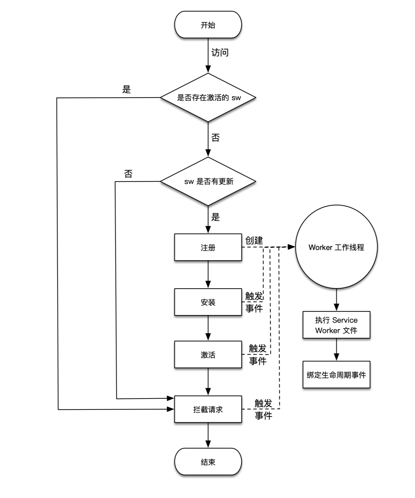
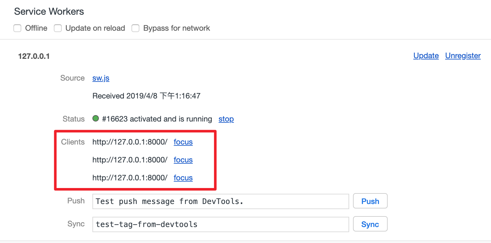
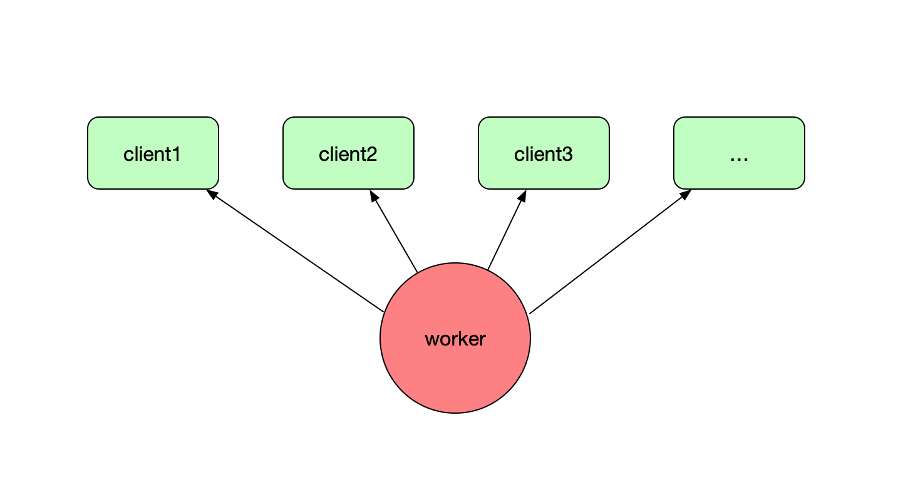
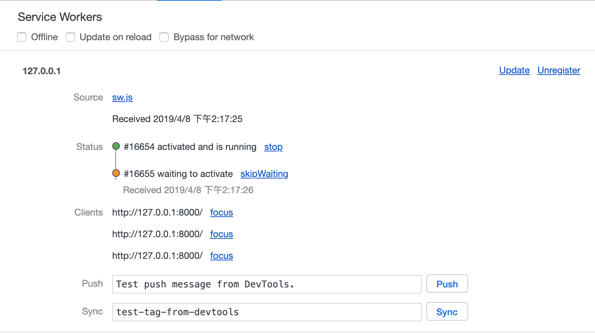
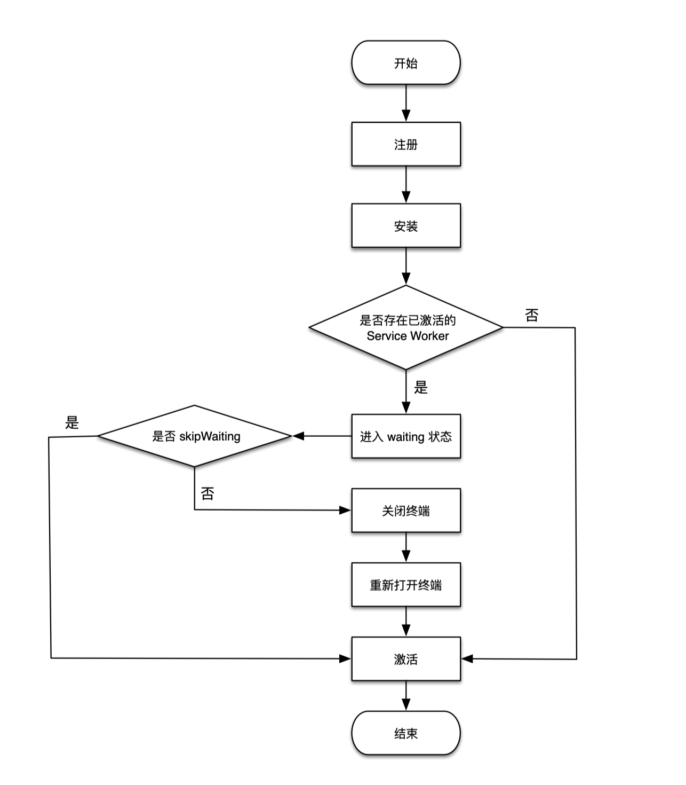
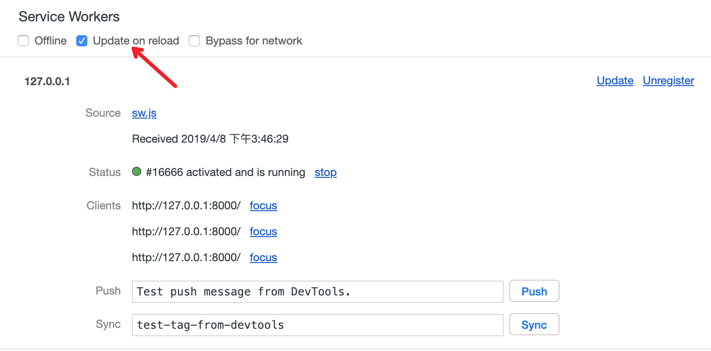

# Service Worker 工作原理

前面已经介绍了 Service Worker 是一个工作线程的本质，也了解了 Service Worker 可以离线工作，还介绍了 Service Worker 在主线程中是如何被注册的。但是到现在为止还是不知道 Service Worker 具体怎么在实际项目中应用。也不知道如何去开发和维护一个 Service Worker 文件。我们已经知道了 Service Worker 是可以对 Web App 的资源和请求进行离线缓存，那它到底是如何进行离线缓存控制的呢？

在本节，我们会深入的介绍一下 Service Worker 的工作原理，Service Worker 的工作原理主要体现在它的生命周期上，一个 Service Worker 从被注册开始，就会经历自身的一些生命周期的节点，而在这些节点都可以去做一些特定的事情，比如一些复杂的计算、缓存的写入、缓存的读取等操作。通过这些生命周期节点的联合调度，Service Worker 才能完成复杂的资源离线缓存的工作。而开发者只有了解了 Service Worker 的生命周期，才能通过设计相关逻辑，并开发 Service Worker 文件 `sw.js` ，让 Service Worker 去完成 PWA 离线缓存策略。

## 生命周期

先来了解下什么是 Service Worker 的生命周期，每个 Service Worker 都有一个独立于 Web 页面的生命周期，其示意图如下图 4-7 所示。


1. 在主线程成功注册 Service Worker 之后，开始下载并解析执行 Service Worker 文件，执行过程中开始安装 Service Worker，在此过程中会触发 worker 线程的 install 事件。

2. 如果 install 事件回调成功执行（在 install 回调中通常会做一些缓存读写的工作，可能会存在失败的情况），则开始激活 Service Worker，在此过程中会触发 worker 线程的 activate 事件，如果 install 事件回调执行失败，则生命周期进入 Error 终结状态，终止生命周期。

3. 完成激活之后，Service Worker 就能够控制作用域下的页面的资源请求，可以监听 fetch 事件。

4. 如果在激活后 Service Worker 被 unregister 或者有新的 Service Worker 版本更新，则当前 Service Worker 生命周期完结，进入 Terminated 终结状态。

Service Worker 生命周期是一个比较复杂的知识点，其中有较多的细节需要深入理解，为了更清楚的进行介绍，接下来新建一个项目 serviceWorkerLifecycleDemo，项目目录结构如下：

```bash
.
└── serviceWorkerLifecycleDemo/
    ├── imgs/
    │   └── dog.jpg
    ├── index.html
    └── sw.js
```

首先，需要有一个 Service Worker 的注册入口，所以 `index.html` 的代码内容如下所示：

```html
<!DOCTYPE html>
  <head>
    <title>Service Worker Lifecycle Demo</title>
  </head>
  <body>
    
    <script>
      if ('serviceWorker' in navigator) {
        // 由于 127.0.0.1:8000 是所有测试 Demo 的 host
        // 为了防止作用域污染，将安装前注销所有已生效的 Service Worker
        navigator.serviceWorker.getRegistrations()
          .then(regs => {
            for (let reg of regs) {
              reg.unregister()
            }
            navigator.serviceWorker.register('./sw.js')
          })
      }
    </script>
  </body>
</html>
```

> 注意：
> 由于 Service Worker 一旦注册后就会永久生效，而生效的控制范围是根据作用域来控制的，我们所有的测试 host 都为 `127.0.0.1:8000`，这样会导致新的项目还没注册 Service Worker 却已经被之前注册的 Service Worker 所控制，所以通常在注册新的 Service Worker 的时候，为了**彻底防止作用域污染**的做法就是在注册前将所有现存控制当前页面的 Service Worker 全部注销掉，或者在 Chrome Devtools 中每次都将老的 Service Worker 手动 unregister 掉。

这次在 serviceWorkerLifecycleDemo 项目的 HTML 文件中加入一个 `` 标签来加载一张图片，主要是用来理解 Service Worker 如何在生命周期中进行离线与缓存处理的。

虽然空的 Service Worker 文件也是可以通过注册来新开一个 Service Worker 线程，但是通常 Service Worker 文件中需要编写一些 JavaScript 代码逻辑来完成 Web App 的离线与缓存的策略设计。接下来我们会一步步的详细讲解这些代码该如何编写，首先先给 `sw.js` 写入以下代码，用来理解 Service Worker 的生命周期：

```js
// sw.js
console.log('service worker 注册成功')

self.addEventListener('install', () => {
  // 安装回调的逻辑处理
  console.log('service worker 安装成功')
})

self.addEventListener('activate', () => {
  // 激活回调的逻辑处理
  console.log('service worker 激活成功')
})

self.addEventListener('fetch', event => {
  console.log('service worker 抓取请求成功: ' + event.request.url)
})
```

这段代码一开始是直接通过 `console.log()` 打印输出一段内容，然后绑定了三个事件，分别是 `install`、`activate`、`fetch` 事件，用来响应 Service Worker 生命周期的事件触发。

接下来用 Chrome 浏览器来测试一下 serviceWorkerLifecycleDemo 这个例子，为了更好的理解测试结果，在打开测试页面 `http://127.0.0.1:8000` 之前需要将所有的浏览器标签关闭（后面会详细解释为什么需要如此操作）。不出意外的话，**第一次**访问 `http://127.0.0.1:8000` 页面的时候 Chrome Devtools Console 控制台的打印结果如下：

```bash
service worker 注册成功
service worker 安装成功
service worker 激活成功
```

当我们**第二次**刷新页面的时候，这时候控制台的打印结果如下：

```bash
service worker 抓取请求成功：http://127.0.0.1:8000/imgs/dog.jpg
```

从这个执行结果来看，初步能够说明以下几点：

- Service Worker 文件只在首次注册的时候执行了一次。
- 安装、激活流程也只是在首次执行 Service Worker 文件的时候进行了一次。
- 首次注册成功的 Service Worker 没能拦截当前页面的请求。
- 非首次注册的 Service Worker 可以控制当前的页面并能拦截请求。

Service Worker 在内部都有一系列的工作流程，这些工作流程决定了开发者可以在 Service Worker 文件中如何进行开发。下图 4-8 展示的是 Service Worker 工作流程图。



实际上 Service Worker 首次注册或者有新版本触发更新的时候，才会重新创建一个 worker 工作线程并解析执行 Service Worker 文件，在这之后并进入 Service Worker 的安装和激活生命周期。

而在首次注册、安装、激活之后，Service Worker 已经拿到了当前页面的控制权了，但为什么首次刷新却没有拦截到网络请求呢？主要是因为在 Service Worker 的注册是一个异步的过程，在激活完成后当前页面的请求都已经发送完成，因为时机太晚，此时是拦截不到任何请求的，只能等待下次访问再进行。

而第二次刷新页面，由于当前站点的 Service Worker 是处于激活状态，所以不会再次新建 worker 工作线程并执行 Service Worker。也就是说激活状态的 Service Worker 在一个站点只会存在一个 worker 工作线程，除非 Service Worker 文件发生了变化（手动 unregister Service Worker 也会注销掉 worker 工作线程），触发了浏览器更新，才会重新开启生命周期。而由于 Service Worker 工作线程的离线特性，只要处于激活状态，在后续的任何访问中，都会通过 fetch 事件监听器拦截当前页面的网络请求，并执行 `fetch` 事件回调。

## waitUntil 机制

如果 Service Worker 安装失败会导致 Service Worker 生命周期终止。由于 Service Worker install 回调是在用户首次访问注册的时候才会触发，所以在项目设计的时候，会将 Web App 一些只有上线才会改变的静态资源会在 install 阶段进行缓存，让用户更快的体验到缓存加速的好处。如果缓存成功了才算是 Service Worker 安装完成，如果这些静态资源缓存失败了，那 Service Worker 安装就会失败，生命周期终止。

什么情况下才算是 Service Worker 安装失败呢？如果在 Service Worker 文件中的 install 回调中写一段错误逻辑会不会导致安装失败呢？接下来修改一下 serviceWorkerLifecycleDemo 的 `sw.js`，代码如下：

```js
// sw.js
console.log('service worker 注册成功')

self.addEventListener('install', () => {
  // 一段一定会报错的代码
  console.log(a.undefined)
  console.log('service worker 安装成功')
})

self.addEventListener('activate', () => {
  // 激活回调的逻辑处理
  console.log('service worker 激活成功')
})

self.addEventListener('fetch', event => {
  console.log('service worker 抓取请求成功: ' + event.request.url)
})
```

在 install 事件回调中，插入了一段一定会报错的代码，看看是不是会导致 Service Worker 的安装失败呢？

> 注意：
> 前面介绍过，由于修改了 sw.js，所以会触发 Service Worker 更新机制，而这次测试是纯粹介绍首次安装失败的情况，为保证实验的纯粹性，需要在 Chrome DevTools 中将存在的 Service Worker 手动 unregister 掉，在后面介绍 Service Worker 更新机制的时候会详细解释其原理。

示例运行结果如下图 4-9 所示：


从运行结果看，当 install 回调中的逻辑报错了，并不会影响 Service Worker 的生命周期继续向后推进，因为运行结果还是有 `激活成功`，甚至第二次刷新发现还能正常拦截请求。

所以说并不是 intall 回调中出错了就会导致生命周期中断。由于 Service Worker 生命周期异步触发的特性，并不是像同步执行模式，如果报错就会中断执行。Service Worker 事件回调的参数是一个 ExtendableEvent 对象，在 Service Worker 中需要使用 `ExtendableEvent.waitUntil()` 方法来保证生命周期的执行顺序。该方法接收一个 Promise 参数，开发者通常会将安装的回调执行逻辑（如缓存的写入）封装在一个 Promise 里，如果操作报错应该通过 Promise 来 reject 错误，这样 Service Worker 就知道了安装失败，然后 Service Worker 就能中断生命周期。接下来修改 `sw.js` 代码如下所示：

```js
// sw.js
console.log('service worker 注册成功')

self.addEventListener('install', event => {
  // 引入 event.waitUntil 方法
  event.waitUntil(new Promise((resolve, reject) => {
    // 模拟 promise 返回错误结果的情况
    reject('安装出错')
    // resolve('安装成功')
  }))
})

self.addEventListener('activate', () => {
  // 激活回调的逻辑处理
  console.log('service worker 激活成功')
})

self.addEventListener('fetch', event => {
  console.log('service worker 抓取请求成功: ' + event.request.url)
})
```

这时候运行刷新页面的时候发现 Service Worker 的生命周期中断，而且没有执行 activate 事件回调。当将 `reject('安装失败')` 改成 `resolve('安装成功')` 的时候，会发现 Service Worker 能够顺利激活。事实上，`ExtendableEvent.waitUntil()` 方法扩展了事件的生命周期。在服务工作线程中，延长事件的寿命能够阻止浏览器在事件中的异步操作完成之前终止 worker 工作线程。

在 install 事件回调被调用时，它把即将被激活的 worker 线程状态延迟为 installing 状态，直到传递的 Promise 被成功地 resolve。这主要用于确保：Service Worker 工作线程在所有依赖的核心 cache 被缓存之前都不会被安装。

不只是 install 事件回调可以调用这个方法，如果在 activate 事件回调被调用时，它把即将被激活的 worker 线程状态延迟为 activating 状态，直到传递的 Promise 被成功地 resolve。这主要用于确保：任何功能事件不会被分派到 ServiceWorkerGlobalScope 对象，直到它升级数据库模式并删除过期的缓存条目。

当 `ExtendableEvent.waitUntil()` 运行时，如果 Promise 是 resolved，任何事情都不会发生；如果 Promise 是 rejected，installing 或者 activating 的状态会被设置为 redundant。

> 注意：
> 如果在 ExtendableEvent 处理程序之外调用 `waitUntil()`，浏览器会抛出一个InvalidStateError 错误。
> 如果多个调用将会堆叠，所产生的所有 promise 将被添加到**延长生命周期的 promise** 等待执行完成。

## 终端

在运行 serviceWorkerLifecycleDemo 示例的时候，提到了需要关闭所有浏览器标签再打开测试页面，其中主要的原因是涉及到 Service Worker 的终端（clients）的概念。

最直接的解释是每一个打开 `http://127.0.0.1:8000` 页面的浏览器标签都是一个终端，如下图 4-10 所示。


在手机端或者 PC 端浏览器，每新打开一个已经激活了 Service Worker 的页面，那 Service Worker 所控制的终端就新增一个，每关闭一个包含已经激活了 Service Worker 页面的时候（不包含手机端浏览器进入后台运行的情况），则 Service Worker 所控制的终端就减少一个，如上图 4-10 打开了三个浏览器标签，则当前 Service Worker 控制了三个终端，通过 Chrome 浏览器 Devtools 的 `Applications -> ServiceWorker` 标签可以查看如下图 4-11 所示 Service Worker 控制的三个终端。



当刷新其中一个浏览器标签的时候，会发现一个奇怪的现象，当前的浏览器标签的控制台打印了一条信息如下所示：

```bash
service worker 抓取请求成功: http://127.0.0.1:8000/imgs/dog.jpg
```

而并没有对其他的两个浏览器标签进行刷新，但是它们的控制台也出现了打印信息：

```bash
service worker 抓取请求成功: http://127.0.0.1:8000/
service worker 抓取请求成功: http://127.0.0.1:8000/imgs/dog.jpg
```

这主要是因为，所有的终端共用一个 worker 工作线程，当在 worker 线程中执行 `console.log()` 方法打印内容的时候，会作用到所有的终端，worker 工作线程和终端的关系如下图 4-12 所示。



`console.log` 是浏览器提供的一种特殊的 I/O 操作，并不是常规操作。通常开发者不会这样来应用这种终端机制，一般而是借助 postMessage 机制来通过 worker 工作线程控制终端，worker 线程在某个生命周期回调 postMessage 给各个终端，终端预先绑定 onmessage 事件，回调处理 worker 线程发送过来的指令，可以做一些后台统计的相关工作，甚至可以用这种机制在 Service Worker 线程中，集中对所有终端的 UI 进行统一处理。

### clients.claim() 方法

如果使用了 skipWaiting 的方式跳过 waiting 状态，直接激活了 Service Worker，可能会出现其他终端还没有受当前终端激活的 Service Worker 控制的情况，切回其他终端之后，Service Worker 控制页面的效果可能不符合预期，尤其是如果 Service Worker 需要动态拦截第三方请求的时候。

为了保证 Service Worker 激活之后能够马上作用于所有的终端，通常在激活 Service Worker 后，通过在其中调用 `self.clients.claim()` 方法控制未受控制的客户端。`self.clients.claim()` 方法返回一个 Promise，可以直接在 `waitUntil()` 方法中调用，如下代码所示：

```js
self.addEventListener('activate', event => {
  event.waitUntil(
    self.clients.claim()
      .then(() => {
        // 返回处理缓存更新的相关事情的 Promise
      })
  )
})
```

> 注意：
> 很多开发者默认就在 Service Worker 文件中使用 `self.clients.claim()`。不建议这么绝对，还是要根据具体项目而定，主要看是否有激活 Service Worker 之后马上控制所有终端的需求。

## Service Worker 更新原理

在运行 serviceWorkerLifecycleDemo 的时候，之前提到过，在每次修改 Service Worker 文件的时候，如果需要刷新页面验证效果，都应提前在 Chrome Devtools 中手动 unregister 当前的 Service Worker，主要是因为修改 Service Worker 文件都会触发其更新，而 Service Worker 的更新过程比较复杂，为了区分首次安装、激活和更新触发的安装、激活，保证效果的一致性，所以才有此建议。那接下来重点地讲解一下 Service Worker 的更新原理，看看里面到底有什么门道。

修改 serviceWorkerLifecycleDemo 的 `index.html` 中注册 `sw.js` 部分的逻辑，用于触发 Service Worker 的更新（当然也可以修改 Service Worker 文件的某些内容），如下所示：

```js
// 触发 Service Worker 的更新
navigator.serviceWorker.register('./sw.js?v=20190401235959')
```

刷新页面之后控制台打印的内容只有 `注册成功`，说明更新 Service Worker 会重新解析执行 Service Worker 的 JavaScript 代码，会触发安装回调，但是没有完成激活。查看 Chrome Devtools 的 Service Worker 面板发现 Service Worker 确实卡在激活状态了，状态为 `waiting to activate`，如下图 4-13 所示：



这就是更新 Service Worker 和首次安装 Service Worker 的一个区别所在。下面通过下图 4-14 了解一下 Service Worker 更新的原理。



当浏览器监测到新的 Service Worker 更新之后，会重新进行注册、安装，当检测到当前的页面被激活态的 Service Worker 控制着的话，会进入 waiting 状态，之后可以有两种选择：

1. 通过 skipWaiting 跳过 waiting 状态
2. 在所有终端保持 waiting 状态，直到 Service Worker 对**所有**终端失去控制（关闭所有终端的时候）

通过运行 serviceWorkerLifecycleDemo 可以发现，将之前启动的三个终端全部关闭掉，然后再新开一个浏览器标签打开 `http://127.0.0.1:8000` 之后，会发现新的 Service Worker 已经激活成功。

还可以有另外一种方法，就是在 Chrome Devtools 中点击 “**skipWaiting**” 按钮，这样就会发现 Service Worker 直接进入了激活状态（反复测试 Demo，记得修改 Service Worker 内容或 URL 以触发 Service Worker 的更新）。

### skipWaiting

Service Worker 一旦更新，需要等所有的终端都关闭之后，再重新打开页面才能激活新的 Service Worker，这个过程太复杂了。通常情况下，开发者希望当 Service Worker 一检测到更新就直接激活新的 Service Worker。如果不想等所有的终端都关闭再打开的话，只能通过 skipWaiting 的方法了，但是总不能让用户自己去浏览器中点击 “skipWaiting” 按钮吧？

Service Worker 在全局提供了一个 `skipWaiting()` 方法，`skipWaiting()` 在 waiting 期间调用还是在之前调用并没有什么不同。一般情况下是在 install 事件中调用它，接下来验证一下效果，可以通过如下代码所示的方式修改 `sw.js` 代码。

```js
// sw.js
console.log('service worker 注册成功')

self.addEventListener('install', event => {
  // 跳过等待
  self.skipWaiting()
  // 引入 event.waitUntil 方法
  event.waitUntil(new Promise((resolve, reject) => {
    // 模拟 promise 返回错误结果的情况
    // reject('安装出错')
    resolve('安装成功')
    console.log('service worker 安装成功')
  }))
})

self.addEventListener('activate', () => {
  // 激活回调的逻辑处理
  console.log('service worker 激活成功')
})

self.addEventListener('fetch', event => {
  console.log('service worker 抓取请求成功: ' + event.request.url)
})
```

通过调用 `skipWaiting()` 方法，运行 Demo 之后刷新任何一个页面都会发现，新的 Service Worker 被激活了。这种方式也被普遍应用在 Service Worker 的更新策略中，主要是为了让用户能够最快的体验到站点的升级和变化。

> 注意：
> skipWaiting() 意味着新 Service Worker 可能会控制使用较旧 Service Worker 控制的页面。这意味着页面提取的部分数据将由旧 Service Worker 处理，而新 Service Worker 处理后来提取的数据。如果预期到缓存数据不一致的现象会导致问题，则不要使用 skipWaiting() 跳过 waiting 状态。

### 手动更新

当刷新页面重新执行 register 方法的时候，浏览器检测到 Service Worker 文件更新就会触发 Service Worker 更新，但是如果站点在浏览器后台长时间没有被刷新，则浏览器将自动检查更新，通常是每隔 24 小时检查一次，但是 24 小时也太长了，所以也可以在代码中手动触发更新，通常做法如下代码所示：

```js
navigator.serviceWorker.register('/sw.js')
  .then(reg => {
    setInterval(() => {
      reg.update()
    }, 60 * 60 * 1000)
  })
```

如果开发者期望用户可以长时间使用您的网站而不必重新加载，您需要按一定间隔（如每小时）调用 `update()` 方法。

### update on reload

Service Worker 生命周期是专为用户构建的，这就给开发工作带来一定的困难。幸运的是，我们可借助 Chrome 的 Devtools 的 “update on reload” 功能，在开发调试 Service Worker 生命周期的时候非常友好。如下图 4-15 所示。



通过 update on reload 功能，开发者可以做到以下几点：

1. 重新提取 Service Worker。
2. 即使字节完全相同，也将其作为新版本安装，这表示运行 install 事件并更新缓存。
3. 跳过 waiting 阶段，直接激活新 Service Worker。
4. 浏览页面，每次浏览时（包括刷新）都将进行更新，无需重新加载两次或关闭标签。

所以在测试 serviceWorkerLifecycleDemo 的时候，不妨试一下 update on reload 功能吧。

## 小结

本节介绍了 Service Worker 的生命周期以及更新机制，了解了 Service Worker 具体的运作方式。虽然目前对 Service Worker 技术点有了全面的了解，但是还是没有涉及到任何离线与缓存相关的东西，为了更加系统深入了解 PWA 离线缓存机制，在下一章中会对 Service Worker 缓存管理进行详细介绍。

