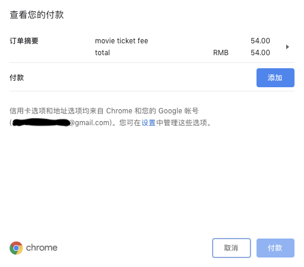
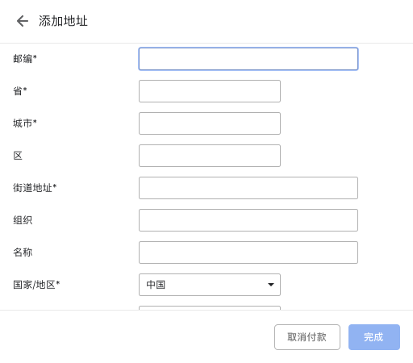
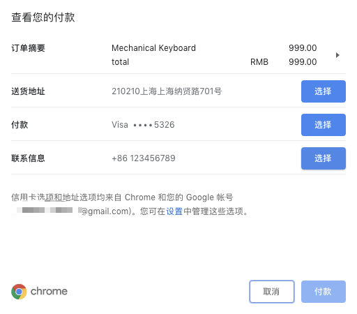

# Payment Request API

对于用户留存来说，浏览器的支付功能就是培养用户习惯的利器，一旦用户习惯了在 Web 站点中可以直接使用支付 API 进行购物等消费活动，那么 Web 站点的用户留存率自然就提高了。

虽然目前各大现代浏览器对 Payment Request API 的支持度都还不是很完美，但是这也不妨碍我们去对它进行初步的尝试。本节将从以下几个方面对 Payment Request API 进行介绍：

- Payment Request API 解决的问题
- Payment Request API 的简单使用
- Payment Request API 安全性分析
- Payment Request API 的未来展望

## Payment Request API 解决的问题

顾名思义，很容易发现 Payment Request API 解决的问题就是支付的问题，而且是利用浏览器来解决这个问题。不同于手机 Native App 的支付，普通 PC 端和手机端的浏览器都能使用 Payment Request API 进行支付，这也是一大亮点。

那支付问题是什么呢？

简单举个例子，现代社会很多人都会有网上购物的需求。如果我想在淘宝买东西，而且还是第一次，那么很有可能我就会去找个电脑，用浏览器打开淘宝，注册个账号然后开始逛淘宝。最后下单的时候，需要输入收货地址等一系列信息，然后提交。

然而问题远远没有结束，订单提交后支付问题接踵而至。由于是第一次逛淘宝，所以支付宝也没有，又得注册个账号，绑定银行卡信息，然后授权进行支付。这下可算买到东西了，但是逛京东的时候这些问题又来了，而且京东的界面和淘宝的界面还不一样，流程也不一样，用户体验也就因此不同，产生的实际收益也因此有所差异。如果是一些网站的支付体验特别差，那么可能直接造成用户的流失，这样就非常得不偿失了。另外，各个网站不同的支付 API 对于开发人员也是一种煎熬。

所以 Payment Request API 就是为了解决上述问题而被提出的。

简单来说，Payment Request API 就是以一套原生的支付界面代替了原来各个商家自己设计的界面，所以整个流程变得高度统一。填一次收货地址信息和银行卡信息就能在所有的网站中使用，这就是 Payment Request API 最大的魅力。

总的来说，Payment Request API 是新的浏览器标准，旨在取代各种商家的结账流程，提供统一的风格和体验。因此它具有如下几个特点：

- 使浏览器充当用户和商家的中介
- 使支付流程统一风格，形成标准
- 适合任何拥有浏览器的电子设备
- 可以对接各种不同的支付方式

## Payment Request API 的简单使用

在使用 Payment Request API 之前，我们先来了解一下 Payment Request API 的整体使用流程。

1. 商家为用户购买的商品创建 PaymentRequest ，其中包含金额、币种和支付方式等信息
2. 浏览器确定兼容性后，展示支付界面
3. 用户选择支付方式后确认执行或者取消交易
4. 浏览器反馈用户支付的结果

### 创建 PaymentRequest

Payment Request API 有一定的兼容性问题，所以下面的示例代码都是在支持 Payment Request API 的情况下运行的，如果使用者在生产环境下使用，请务必解决兼容性问题。

```js
let request = new PaymentRequest(
  methodData, // 需要的支付方式
  details,    // 账单信息
  options     // 其他消息
);
```

上述代码中，`methodData` 变量是一个数组，数组内的每一项都是一个字典，其中包含支持的支付方式和相应的各种信息。`details` 变量是交易的详细信息，包含的基本元素有`id`，`displayItems`，`total`，分别代表订单号、购买物品列表和总额。当然，`details` 还可以有一些其他信息，如快递信息等。`options` 变量也是一个字典，用来设置哪些信息需要用户填写。下面代码示例中的 `options` 就表明了用户需要输入姓名、手机号和送货信息。

```js
function createPaymentRequest () {
  let methodData = [{
    supportedMethods: 'basic-card',
    data: {
      supportedNetworks: ['visa', 'mastercard'],
      supportedTypes: ['debit', 'credit'],
    }
  }]
  let details = {
    id: 'order-2049',
    displayItems:[{
      label: 'Mechanical Keyboard',
      amount: { currency: 'RMB', value: '999.00' }
    }],
    total: {
      label: 'total',
      amount: { currency: 'RMB', value: '999.00' }
    }
  }
  let options = {
    requestPayerEmail: false,
    requestPayerName: true,
    requestPayerPhone: true,
    requestShipping: true,
  }
  return new PaymentRequest(methodData, details, options)
}
```

### 展示支付界面

```js
function show () {
  let request = createPaymentRequest()
  request.show().then(function (paymentResponse) {
    handle(paymentResponse)
  }).catch(function (e) {
    console.log(e)
  })
}
```

展示支付界面是比较简单的，只要调用 PaymentRequest 的 show 方法即可。另外还有个 abort 方法，这是用来主动取消 PaymentRequest ，其目标使用场景可以是秒杀活动或商品售罄的情况。另外还有很多其他方法，这里不再赘述。



### 用户确认支付

在展示支付界面之后，一般是用户填写付款账号信息。如果不是第一次填写，还可以直接自动填充之前填好的信息。简单示例界面如下：




这个步骤就是 Payment Request API 提供的风格统一的支付界面。在这个步骤之后就是用户确认付款，一旦点击付款按钮，这操作就不可逆了。之后就是等待浏览器与运营商之间的交互，根据交互结果如何，我们分别给出应答界面。

### 浏览器反馈用户支付的结果

在 Payment Request API 中，浏览器作为中介，只是收集用户填写的信息，然后按照商家的要求发送到指定的服务器，等待他们的处理，处理完了之后，页面就会显示正确的信息。

这些过程简单来说就是上述示例代码中 `handle` 函数的作用。简单写个示例，如下：

```js
function handle (paymentResponse) {
  let data = {
    method: paymentResponse.methodName,
    details: paymentResponse.details
  }
  let init = {
    method: 'POST',
    body: JSON.stringify(data),
    credentials: 'include',
    headers: {
      'content-type': 'application/json'
    }
  }
  return fetch('/payment', init)
    .then(function (res) {
      if (res.status === 200) {
        return res.json()
      } else {
        throw new Error('payment error')
      }
    }).then(function (res) {
      paymentResponse.complete('success')
    }, function (error) {
      paymentResponse.complete('fail')
    })
}
```

## Payment Request API 安全性分析

对于支付相关的问题，我相信很多人都会在意安全性如何。如果支付安全不能得到保障，那么提出这一系列的 API 就没有任何实际意义。

不过由于 Payment Request API 的规范还没有完全确定，所以目前考虑到的安全问题可能也不是十分全面，但也值得一提。

上文提到的 show 方法将会严格定义为在用户交互的情况下，才会被触发，这很好地防止了用户在未察觉的情况下被第三方调起支付界面。另外 Payment Request API 只会允许在安全的环境下运行，比如 HTTPS，因为一些敏感信息一旦是明文传输，那后果将不堪设想。针对跨域的支付请求，相关规范在提出的过程中被讨论了好多次。特别是 `iframe` 标签经常被商家用来和第三方支付机构通信，所以目前的标准准备在 `iframe` 标签上增加一个字段 `allowpaymentrequest` 来支持跨域的支付请求。

还有个人信息的保护在 Payment Request API 的规范中也被提及，像银行卡信息，快递信息等不会在用户没有感知的情况被分享出去。

当然也有一些安全相关的问题一直在被讨论着，比如 `iframe` 标签上的 `sandbox` 属性和 `allowpaymentrequest` 属性同时出场该如何表现的问题，在前不久才有明显的结论。[Payment Request 的 GitHub](https://github.com/w3c/payment-request) 一直都有不错的活跃度，我们相信很多问题在不远的未来都能被很好的解决。

## Payment Request API 的未来展望

根据 caniuse 的反馈，目前现代浏览器中还没有一个完全支持 Payment Request API，但是部分支持的范围已经达到了 `74.74%` ，国内的部分支持率也达到了 `50.5%` (截止到 2018-11-9 的数据)。由此可见，Payment Request API 正在稳步地发展中。不过在我运行上述示例代码的时候，需要事先开启 `web-payments` 功能，我的谷歌浏览器版本是 70，现代大多数浏览器都默认此功能是关闭的。

虽说 Payment Request API 支持的支付方式是挺多的，但是大多数第三方支付是银行，其他的一些第三方支付方式也需要自己跟进。支付宝就积极拥抱变化，[Alipay Payment Method](https://w3c.github.io/webpayments/proposals/Alipay-payment-method.html) 在很早的时候就提出来了。

总的来说，Payment Request API 还是在慢慢地发展中，正如 PWA 的蓬勃发展，Payment Request API 也有一个美好的未来。

> 参考资料：
> [CR-payment-request-20180830](https://www.w3.org/TR/payment-request)
> [Web Payments Overview from google](https://developers.google.com/web/fundamentals/payments)
